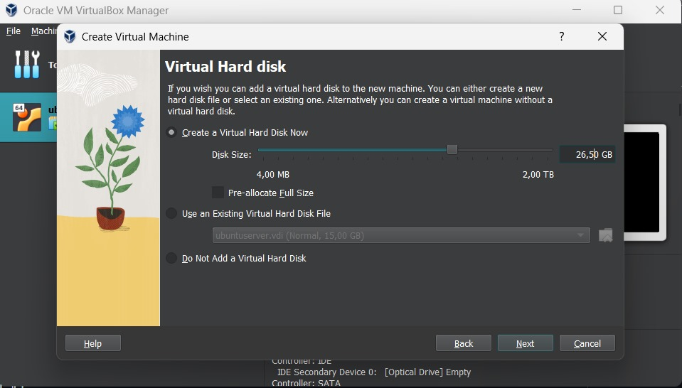
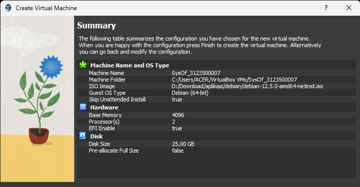
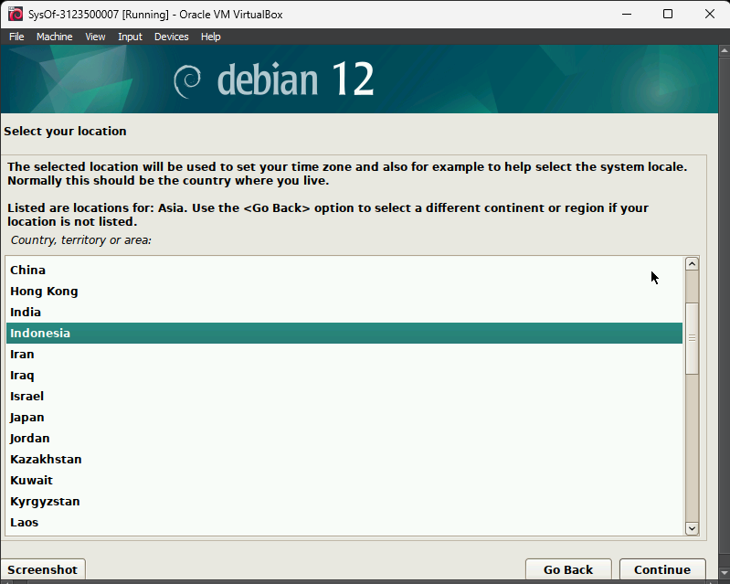
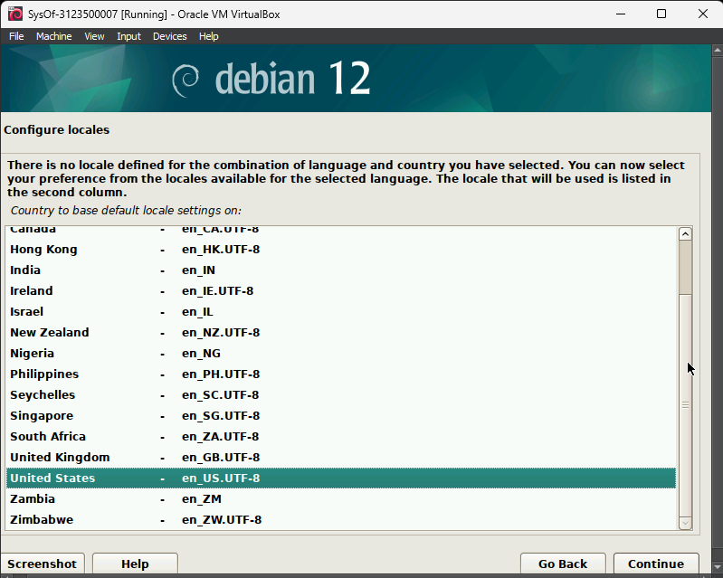
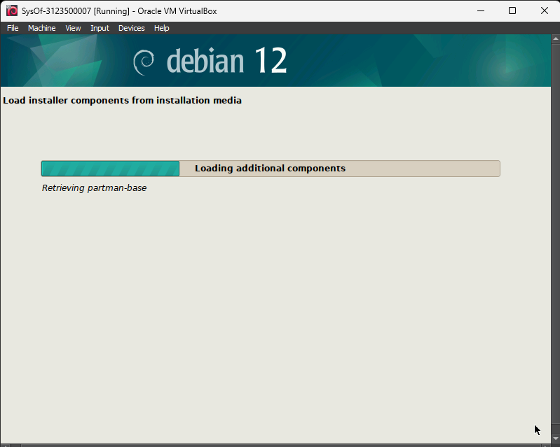
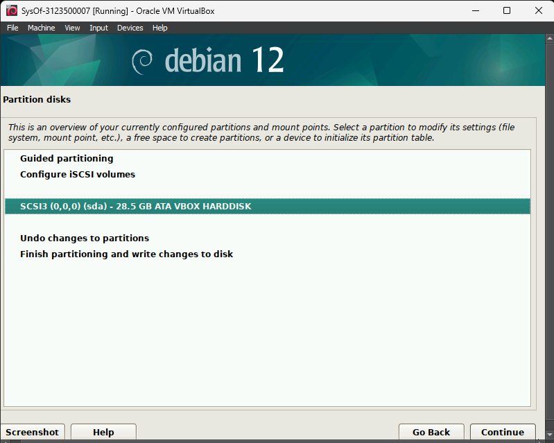
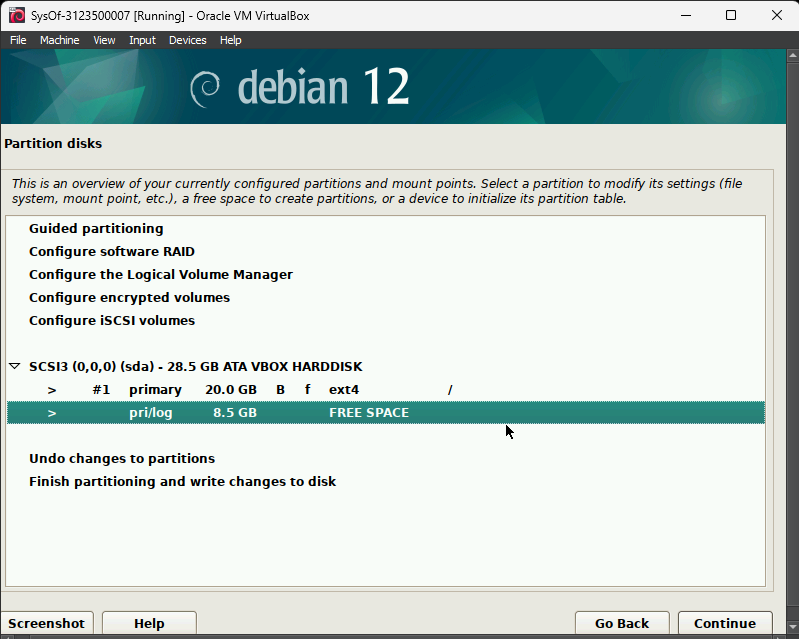
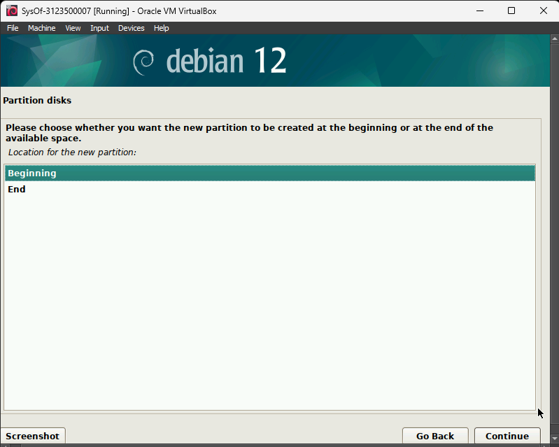
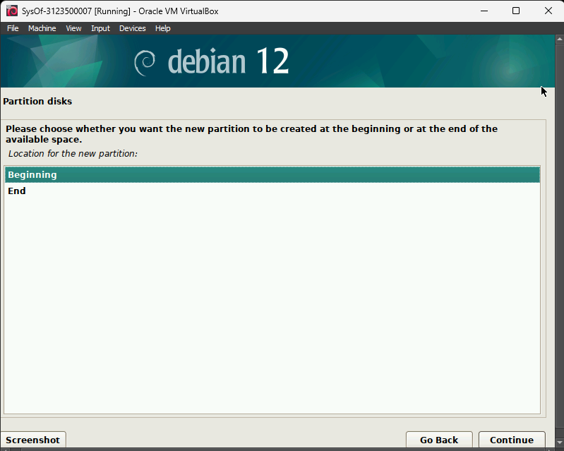
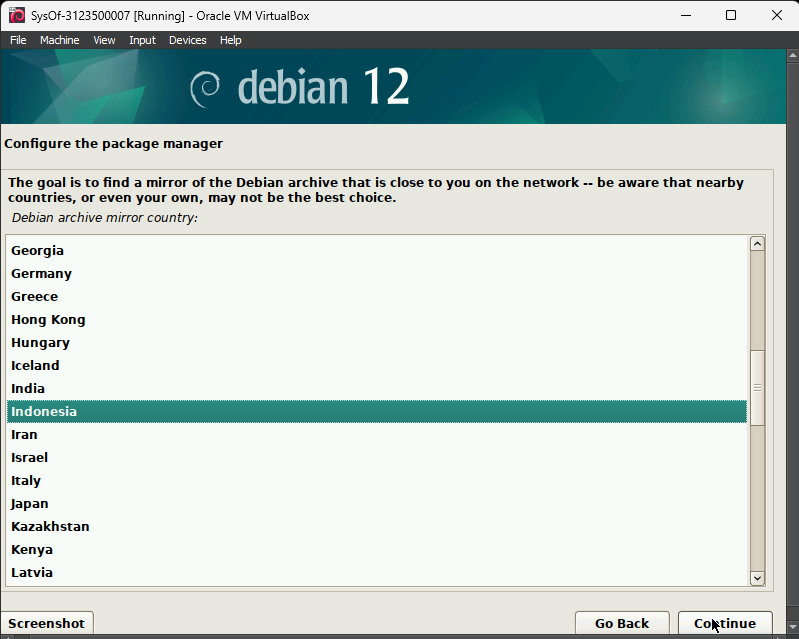

  <h1 class="text-align: center;font-weight: bold">Praktikum 1 Praktek System Operasi</h1>
  <h3 class="text-align: center;">Dosen Pengampu : Dr. Ferry Astika Saputra, S.T., M.Sc.</h3>

 

  
  <h3 style="text-align: center;">Disusun Oleh : </h3>
  

    <strong>Dewangga Wahyu Putera Wangsa (3123500007)</strong> 
    <strong>Hawa Kharisma Zahara (3123500010)</strong> 
    <strong>Bayu Ariyo Vonda Wicaksono (3122500017)</strong>
  

<h3 style="text-align: center;line-height: 1.5">Politeknik Elektronika Negeri Surabaya Departemen Teknik Informatika Dan Komputer Program Studi Teknik Informatika 2023/2024</h3>
  

## Daftar Isi

1. [Pendahuluan](#pendahuluan)
2. [Soal](#proses-booting)
3. [Instalisasi](#instalisasi)
4. [Referensi](#referensi)

## PENDAHULUAN

Sistem operasi (disingkat OS) adalah perangkat lunak fundamental yang mengelola dan mengendalikan semua aspek perangkat, baik perangkat keras maupun perangkat lunak. Ia bertindak sebagai jembatan antara pengguna dan perangkat,

## PROSES BOOTING

### Apa itu booting?

Booting adalah proses yang dilakukan komputer pada saat dinyalakan hingga siap digunakan. Sebagian kita juga mengenal istilah booting sebagai proses startup komputer.

Booting berasal dari kata boot yang merupakan singkatan dari bootstrap atau bootstrapping. Bootstrap menggambarkan proses yang secara otomatis memuat dan menjalankan perintah.

Selama proses booting ini akan memuat beberapa kode ke dalam memori (RAM) yang diperlukan untuk memulai Windows sehingga siap untuk digunakan.

### Proses terjadinya Booting

1. Menekan Tombol Power On
   
   Saat Anda menyalakan komputer, daya listrik mengalir ke komponen-komponen utama, termasuk motherboard dan prosesor.

2. POST (Power-On Self-Test)
   
   Komputer melakukan POST untuk memeriksa dan mengidentifikasi hardware utama seperti RAM, prosesor, dan kartu grafis. Jika ada masalah, komputer bisa memberikan beep atau pesan kesalahan.

3. BIOS/UEFI Initialization
   
   BIOS (Basic Input/Output System) atau UEFI (Unified Extensible Firmware Interface) diaktifkan. Ini adalah perangkat lunak firmware yang terletak di motherboard. BIOS/UEFI memberikan instruksi awal dan menginisialisasi perangkat keras yang diperlukan.

4. Boot Loader
   
   Setelah BIOS/UEFI diinisialisasi, boot loader diaktifkan. Boot loader adalah program kecil yang bertanggung jawab untuk memuat sistem operasi ke dalam memori.

5. Sistem Operasi Loading
   
   Boot loader membaca informasi tentang sistem operasi yang akan dimuat, biasanya dari partisi boot pada hard drive. Kemudian, sistem operasi dimuat ke dalam memori.

6. Kernel Initialization
   
   Setelah sistem operasi dimuat, kernel (inti) sistem operasi diinisialisasi. Kernel bertanggung jawab untuk mengelola sumber daya komputer dan menjalankan proses-proses utama.

7. Login atau Tampilan GUI
   
   Terakhir, sistem operasi menampilkan layar login atau antarmuka pengguna (GUI) yang memungkinkan pengguna untuk masuk dan mulai menggunakan komputer.

## Instalisasi

### A. Virtual Box

1. Pertama, silakan buka browser di PC Anda.
2. Kemudian akses situs resmi VirtualBox.
   [Virtual Box](https://www.virtualbox.org/)
   
3. Kalau sudah, klik Windows host pada kolom VirtualBox 7.0.14 platform packages
   
4. Tunggu proses download selesai
5. Buka File Virtual Box
   
6. Selanjutnya pilih tombol Next
   
   
7. Maka akan muncul notifikasi Warning: Network Interfaces yang menandakan koneksi Anda akan terputus sementara
   
8. Pada notifikasi ini, klik Yes untuk melanjutkan proses instalasi
   
9. Klik Install untuk memulai proses pemasangan VirtualBox
   
10. Tunggu sampai proses instalasi berhasil.
    
11. Kalau sudah, lanjut centang opsi Start Oracle VM Virtual Box dan klik tombol Finish untuk membukanya.
    
12. Selesai.

### B. Debian

1. Klik "new" untuk membuat virtual machine
   
2. Create virtual machine dengan mengisi nama, dan iso image. tap checklist dan next
   
3. Modifikasi base memory dengan ukuran 4096 Mb dan prosesor dengan ukuran 2 CPU
   
4. Mengubah ukuran Virtual Hard Disk menjadi 26,50 GB
   
5. klik Finish  
     
6. Klik Start  
   
7. Pilih Bahasa, disini kami memilih bahasa english  
   
8. Konfigurasi Lokasi, **Asia**  
   
9. Konfigurasi Lokasi, **Indonesia**  
   
10. Konfigurasi wilayah, **United states**
    
11. konfigurasi Keyboard, **American English**
    
12. Tunggu Loading hingga selesai
    
13. Memasukkan Hostname
    
14. Kosongi domain, klik Continue
    
15. Setting Password
    
16. Memasukkan Fullname untuk setup akun
    
17. Memasukkan Username untuk setup akun
    
18. Setting Password
    
19. Konfigurasi Waktu, Western
    
20. Metode Praktisi, Manual
    
21. Memilih Praktisi yang ingin dimodifikasi, **ATA VBOX HARDISK**
    
22. Pilih Opsi **Yes**, lalu Continue
    
23. Pilih FREE SPACE, lalu Continue
    
24. Klik Create a New Partition, lalu Continue
    
25. Masukkan Size Partisi sebesar 20GB, lalu Continue
    
26. Pilih Primary, lalu Continue
    
27. Pilih Beginning, lalu Continue
    
28. Pilih Done setting up the partition, lalu Continue
    
29. Pilih FREE SPACE, lalu Continue
    
30. Klik Create a New Partition, lalu Continue
    
31. Masukkan Size Partisi sebesar 5GB, lalu Continue
    
32. Pilih Primary, lalu Continue
    
33. Pilih Beginning, lalu Continue
    
34. Klik Mount point, pilih Enter Manually
    
35. Ganti menjadi **/storage**
    
36. Klik Done setting up the partition
    
37. Pilih FREE SPACE, lalu Continue  
    
38. Klik Create a New Partition, lalu Continue
    
39. Masukkan Size Partisi sebesar 1.5GB, lalu Continue
    
40. Pilih Primary, lalu Continue
    
41. Pilih Beginning, lalu Continue
    
42. Klik use as, lalu pilih swap area
    
43. Klik Done setting up the partition
    
44. Klik Finish partitioning and write changes to disk
    
45. Tunggu loading install hingga selesai
    
46. Pilih No, lalu Continue
    
47. Pilih packgace manager, indonesia
    
48. Lalu pilih kebo.pens.ac.id
    
49. Http proxy dikosongkan, lalu next
    
50. Tunggu loading hingga selesai
    
51. Pilih Yes, lalu Continue
    
52. Checklist seperti yang tertera digambar bawah ini
    
53. Tunggu loading instal software
    
54. Pilih Yes, lalu Continue
    
55. Pilih sesuai dengan gambar dibawah ini
    
56. Finish instalisasi
    
57. Setelah selesai maka tampilan anda akan seperti dibawah ini, linux debian siap digunakan
    

## Referensi

- [Apa itu Booting](https://www.jetorbit.com/blog/mengenal-apa-itu-booting-fungsi-serta-jenis-jenis-booting/)
- [Proses Booting](https://catatanteknisi.com/pengertian-dan-urutan-proses-booting-komputer/)
- [Download Virtual Box](https://www.virtualbox.org/)
- [Download Debian](https://www.debian.org/download)
