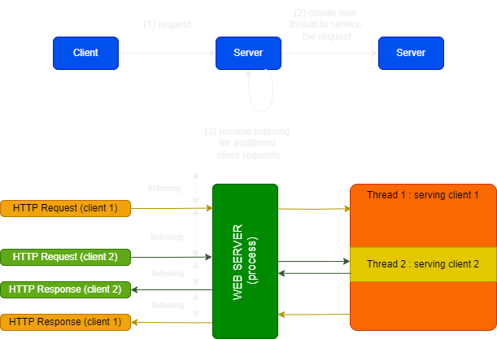
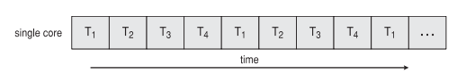
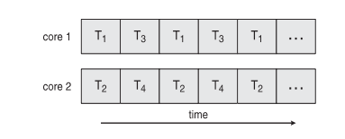
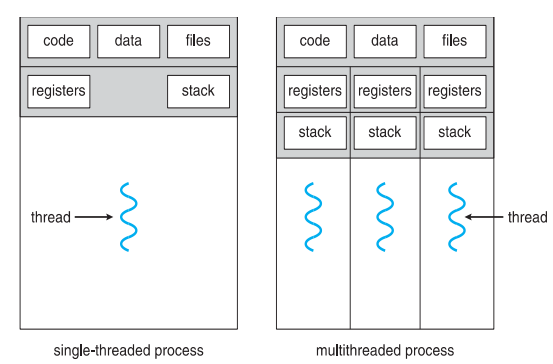
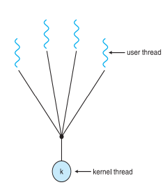
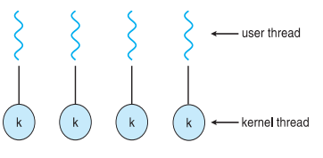
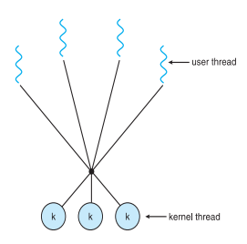

  <h1 class="text-align: center;font-weight: bold">Praktikum 10 Praktek System Operasi</h1>
  <h3 class="text-align: center;">Dosen Pengampu : Dr. Ferry Astika Saputra, S.T., M.Sc.</h3>

 

  
  <h3 style="text-align: center;">Disusun Oleh : </h3>
  

    <strong>Dewangga Wahyu Putera Wangsa (3123500007)</strong> 
    <strong>Hawa Kharisma Zahara (3123500010)</strong> 
    <strong>Bayu Ariyo Vonda Wicaksono (3122500017)</strong>
  

<h3 style="text-align: center;line-height: 1.5">Politeknik Elektronika Negeri Surabaya Departemen Teknik Informatika Dan Komputer Program Studi Teknik Informatika 2023/2024</h3>
  

### Table content

- [Overview](#overview)
- [Multicore Programming](#multicore-programming)
- [Multithreading Models](#multithreading-models)
  - [Many-to-One](#many-to-one)
  - [One-to-One](#one-to-one)
  - [Many-to-Many](#many-to-many)
- [Thread Libraries](#thread-libraries)
- [Implicit Threading](#implicit-threading)
- [Threading Issues](#threading-issues)
- [Signal handling](#signal-handling)
- [Operating System Examples](#operating-system-examples)
- [Referensi](#referensi)

# Threads

## Overview

Aplikasi Modern Memanfaatkan Multithreading: Sebagian besar aplikasi kontemporer memanfaatkan multithreading.

Sebuah thread berjalan di dalam aplikasi itu sendiri.

Thread Terpisah Melakukan Beberapa Tugas: Thread yang berbeda dapat melakukan berbagai tugas dalam aplikasi, seperti memperbarui tampilan, mengambil data, memeriksa ejaan, dan menanggapi permintaan jaringan.

Pembuatan Thread vs. Pembuatan Proses: Thread lebih ringan, tetapi proses membutuhkan lebih banyak sumber daya.

Mensederhanakan Kode dan Meningkatkan Efisiensi: Multithreading dapat membuat kode lebih sederhana dan aplikasi lebih efisien.

Kernel biasanya multithreaded: Kernel sistem operasi biasanya melakukannya.

### Tujuan

- Memperkenalkan Ide Thread: Ide thread adalah komponen penting dari pemanfaatan CPU dan merupakan dasar dari sistem komputer yang memiliki banyak thread.

- Membahas API Pthreads, Windows, dan Libraries Thread Java: Ini membahas antarmuka pemrograman aplikasi (API) yang digunakan untuk mengelola thread dalam beberapa bahasa pemrograman. API ini termasuk Pthreads untuk sistem Unix, Windows API, dan Libraries Thread Java untuk bahasa pemrograman Java.

- Mengkaji Beberapa Teknik untuk Threading Implisit: Baca tentang beberapa cara untuk memberikan threading implisit, yang memungkinkan aplikasi untuk bekerja lebih baik tanpa perlu mengawasi thread secara langsung.

- Memeriksa Masalah Pemrograman Multithreaded: Tinjauan masalah seperti sinkronisasi, perlombaan kondisi, dan deadlock yang terkait dengan pengembangan aplikasi multithreaded.

### Multithreaded Server Architecture

### Keuntungan dari multithreading:

- Responsiveness: Multithreading memungkinkan aplikasi beroperasi bahkan ketika sebagian proses terhalang. Ini sangat penting untuk antarmuka pengguna.

- Berbagi Sumber Daya: Thread lebih mudah membagi sumber daya dari proses daripada menggunakan memori bersama atau pesan.

- Ekonomis: Beralih antar thread memiliki biaya yang lebih rendah daripada beralih konteks, dan membuat thread lebih murah daripada membuat proses.

- Skalabilitas: Proses dapat meningkatkan kinerja secara keseluruhan dengan memanfaatkan arsitektur multiprosesor.

## Multicore Programming

Kemampuan sistem untuk melakukan beberapa tugas secara bersamaan disebut paralelisme.

Sebaliknya, konkurrensi memungkinkan kemajuan lebih dari satu tugas pada waktu yang sama, terutama dalam sistem yang diatur oleh penjadwal dengan satu prosesor atau inti.

### Jenis parallelisme meliputi:

- Parallelisme data adalah ketika sekumpulan data yang sama dibagi menjadi berbagai inti atau core, dan setiap inti melakukan operasi yang sama pada setiap subset data.

- Parallelisme Tugas: Membagi thread atau tugas ke berbagai inti atau core, dengan masing-masing menjalankan operasi yang berbeda.

Para programmer menghadapi beberapa masalah karena sistem multicore atau multiprocessor:

- Membagi Aktivitas: Membagi tugas menjadi bagian yang dapat dilakukan secara bersamaan.

- Keseimbangan: Memastikan bahwa semua inti atau prosesor menggunakan sumber daya secara seimbang.

- Pemisahan Data: Memisahkan data sehingga berbagai inti atau prosesor dapat menggunakannya dengan baik.

- Ketergantungan Data: Menjaga ketergantungan data agar operasi paralel tidak terjadi konflik.

- Pengujuan dan Pemecahan Masalah: Uji coba dan debugging dilakukan pada kode paralel untuk memastikan kinerja dan keandalan yang diharapkan.

### Concurrency vs. Parallelism

- Concurrent execution on single-core system

- Parallelism on a multi-core system

### Single and Multithreaded Processes

### Amdahl’s Law

Rumus Hukum Amdahl adalah rumus yang dapat digunakan untuk menentukan peningkatan kecepatan maksimum yang dapat dicapai sistem hanya dengan meningkatkan komponen tertentu. Misalnya, peningkatan kinerja keseluruhan sistem dengan prosesor yang lebih cepat akan dibatasi oleh kecepatan RAM, sehingga peningkatan kinerja keseluruhan sistem akan dibatasi oleh komponen sistem yang tidak ditingkatkan.

Dalam rumus ini, "Waktu Total" adalah jumlah waktu yang diperlukan untuk menyelesaikan seluruh tugas, dan "Waktu yang Tidak Dapat Ditingkatkan" adalah jumlah waktu yang diperlukan untuk menyelesaikan bagian sistem yang tidak dapat ditingkatkan.

Hukum Amdahl sangat membantu dalam memahami kendala kinerja sistem. Anda dapat menggunakannya untuk membuat keputusan tentang metode terbaik untuk meningkatkan kinerja sistem.

### User Threads and Kernel Threads

Terdapat dua jenis utama dari pengelolaan thread:

- User Threads: Threads POSIX, Windows Threads, dan Java adalah contoh perpustakaan thread level pengguna.

- Kernel Threads: Hampir semua sistem operasi umum, seperti Windows, Solaris, Linux, Tru64 UNIX, dan Mac OS X, mendukung kernel sistem operasi.

## Multithreading Models

### Many-to-One

Terdapat model dimana banyak thread tingkat pengguna (thread user-level) ke satu thread kernel. Model ini kurang digunakan karena beberapa keterbatasan, seperti:

Jika satu thread mengalami operasi memblokir, semua thread yang terkait dengan thread kernel tersebut akan terblokir.

Keterbatasan pada eksekusi paralel: Dalam sistem multicore, hanya satu thread kernel yang dapat berjalan pada satu waktu. Akibatnya, eksekusi paralel thread tingkat pengguna dibatasi.

Keterbatasan pada penggunaan sumber daya: Saat mengelola banyak thread tingkat pengguna, thread kernel dapat mengalami biaya yang tinggi karena pengalihan antar thread tingkat pengguna.

### One-to-One

Dalam model ini, setiap thread tingkat pengguna dipetakan ke thread kernel, dan setiap kali thread tingkat pengguna dibuat, sebuah thread kernel juga dibuat. Ini membuat model ini lebih kompetitif daripada model banyak-ke-satu. Namun, biaya yang terkait dengan pembuatan dan pengelolaan thread kernel kadang-kadang membatasi jumlah thread per proses.

### Many-to-Many

Banyak thread tingkat pengguna dapat dipetakan ke banyak thread kernel berkat model ini, yang memungkinkan sistem operasi membuat jumlah thread kernel yang cukup sesuai kebutuhan. Solaris sebelum versi 9 dan Windows dengan paket ThreadFiber adalah beberapa sistem yang menggunakan model ini.

### Two-level Model

Model ini mirip dengan many to many (M:M), model ini memungkinkan thread tingkat pengguna diikat (bound) ke thread kernel tertentu. Sistem seperti IRIX, HP-UX, Tru64 UNIX, dan Solaris 8, serta versi sebelumnya, adalah contohnya.

## Thread Libraries

Dengan menggunakan Perpustakaan Thread, programmer dapat membuat dan mengelola thread melalui antarmuka pemrograman aplikasi (API):

1. Perpustakaan Thread di Ruang Pengguna (User Space): Semua perpustakaan thread beroperasi di dalam ruang pengguna sendiri, sehingga tidak memerlukan dukungan kernel sistem operasi. Semua operasi terkait thread dilakukan oleh perpustakaan itu sendiri.

2. Perpustakaan Kelas Kernel yang Didukung oleh Sistem Operasi (Kernel-level): Perpustakaan ini didukung langsung oleh kernel sistem operasi, yang berarti operasi yang terkait dengan thread dapat dilakukan dan dijalankan di dalam kernel. Ini memungkinkan Anda mengakses sumber daya sistem operasi secara instan.

### Pthreads

Perpustakaan thread tersedia sebagai perpustakaan tingkat pengguna (user-level) atau tingkat kernel. Standar POSIX (IEEE 1003.1c), yang menyediakan API untuk pembuatan dan sinkronisasi thread, adalah standar yang paling umum.

Standar POSIX ini mencakup beberapa poin penting, antara lain:

- Spesifikasi, bukan Implementasi: Standar POSIX menetapkan perilaku perpustakaan thread, tetapi tidak mengatur implementasi. Pengembang perpustakaan memiliki tanggung jawab untuk menggunakan perpustakaan ini secara efektif.

- Perilaku API: API POSIX menetapkan tindakan yang diharapkan dari perpustakaan thread, seperti manajemen, sinkronisasi, dan pembuatan thread.

- Umum di Sistem Operasi UNIX: API POSIX untuk thread biasanya ada di berbagai sistem operasi berbasis UNIX, seperti Solaris, Linux, dan Mac OS X.

## Implicit Threading

Menggunakan thread secara eksplisit menjadi lebih sulit dengan jumlah thread yang lebih besar. Oleh karena itu, kompiler dan pustaka run-time biasanya melakukan penciptaan dan pengelolaan thread daripada programmer sendiri. Tiga pendekatan utama untuk manajemen thread adalah:

Thread Pools: Teknik ini mengelola kumpulan thread yang dapat digunakan kembali untuk menyelesaikan tugas. Ini mengurangi biaya yang terkait dengan pembuatan dan penghancuran thread.

OpenMP adalah API yang mendukung pemrograman paralel di lingkungan multiprosesor dan memungkinkan compiler untuk menunjukkan secara jelas apakah ada paralelisme dalam kode.

Grand Central Dispatch (GCD): Teknologi yang dikembangkan oleh Apple untuk mengatur eksekusi tugas secara asinkron dalam aplikasi. Ini menggunakan queue untuk menjalankan blok kode di thread pool yang dikelola oleh sistem.

### Thread Pools

Membuat sejumlah thread dalam sebuah pool di mana mereka menunggu pekerjaan memiliki beberapa keuntungan:

Waktu Respons Lebih Cepat: Biasanya, lebih cepat melayani permintaan dengan thread yang sudah ada daripada membuat thread baru. Ini mengurangi overhead yang terkait dengan pembuatan dan penghancuran thread secara berulang-ulang.

Pengendalian Jumlah Thread: Menggunakan thread pool memungkinkan jumlah thread dalam aplikasi untuk disesuaikan dengan ukuran pool. Ini membantu mencegah kelebihan pembuatan thread yang dapat membebani sistem.

Pemecahan Tugas dari Mekanisme Pembuatan Tugas: Memisahkan tugas yang akan dilakukan dari mekanisme pembuatan tugas memungkinkan strategi yang berbeda untuk menjalankan tugas tersebut. Misalnya, tugas-tugas dapat dijadwalkan untuk berjalan secara berkala.

### Open MP

OpenMP (Open Multi-Processing) adalah sekumpulan API dan direktif kompiler untuk bahasa pemrograman C++, FORTRAN, dan C++ yang mendukung pemrograman paralel di lingkungan memori bersama. Berikut adalah beberapa fiturnya dan contohnya:

Mendukung Pemrograman Paralel: Dengan menggunakan direktif kompiler sederhana, OpenMP memungkinkan pemrograman paralel pada sistem multiprosesor atau multicore.

Identifikasi Wilayah Paralel: Direktif #pragma omp parallel digunakan oleh OpenMP untuk mengidentifikasi bagian kode yang dapat dijalankan secara paralel, juga dikenal sebagai wilayah paralel.

Pembuatan Thread Berdasarkan Jumlah Core: Saat menjalankan wilayah paralel, OpenMP secara otomatis membuat jumlah thread yang sama dengan jumlah core prosesor yang tersedia.

Paralelisasi Loop: Anda dapat memparalelisasi loop dengan menggunakan direktif #pragma omp parallel. Ini memungkinkan thread yang berbeda menjalankan setiap iterasi loop secara bersamaan.

### Grand Central Dispatch

Grand Central Dispatch (GCD) adalah teknologi Apple yang digunakan untuk membuat pemrograman paralel lebih mudah di sistem operasi Mac OS X dan iOS. GCD memiliki ekstensi untuk bahasa C dan C++, serta API dan pustaka run-time, yang memungkinkan pengelolaan thread yang mudah dan efektif. Berikut adalah beberapa karakteristik utama GCD:

1. Identifikasi Bagian Paralel: Pengembang dapat mengidentifikasi "blok" kode yang dapat dijalankan secara paralel dengan GCD.

2. Pengelolaan Thread yang Otomatis: GCD mengelola sebagian besar detail threading, seperti pembuatan dan penghancuran thread, serta penjadwalan tugas, sehingga pengembang dapat fokus pada logika aplikasi daripada mengelola thread secara manual.

3. Blok dalam GCD: Bagian kode dalam GCD dibungkus dalam tanda "".

Untuk mengelola eksekusi blok kode secara paralel atau berurutan, Grand Central Dispatch (GCD) menyediakan dua jenis queue pengiriman yang berbeda:

- Sequence Queue:

  Urutan FIFO: Urutan First-In, First-Out (FIFO) digunakan untuk menjalankan blok-blok dalam queue serial. Artinya, blok pertama yang ditambahkan akan dieksekusi.
  Queue per Proses: Setiap proses memiliki satu queue utama, juga disebut sebagai queue serial. Queue utama ini digunakan untuk menjalankan tugas-tugas yang terkait dengan antarmuka pengguna dan memastikan bahwa operasi antarmuka pengguna dilakukan secara berurutan, sehingga kondisi balapan tidak terjadi.
  Additional Serial Queues: Pembangun program dapat membuat queue serial tambahan untuk mengeksekusi tugas tertentu secara berurutan tanpa mengganggu queue utama.

- Concurrent Queue:

Urutan FIFO: Blok-blok dalam queue concurrence juga dihapus dalam urutan FIFO; namun, beberapa blok dapat dieksekusi secara bersamaan (paralel) oleh beberapa thread.
Terdapat tiga sistem queue yang luas: GCD menawarkan tiga sistem queue bersama yang tersebar di seluruh sistem dan memiliki prioritas yang berbeda. Priority Low adalah queue dengan prioritas rendah, Priority Default adalah queue dengan prioritas standar, dan Priority High adalah queue dengan prioritas tinggi.

## Threading Issues

### Pemahaman Sistem Panggilan fork() dan exec()

`fork() :`

- Sistem panggilan yang disebut fork() memungkinkan proses anak (proses anak) dan proses induk (proses induk) untuk menduplikasi proses yang sudah ada untuk membuat proses baru.

- Kecuali untuk beberapa hal, seperti PID (Id Proses) yang unik, proses anak adalah replika dari proses induk.

`exec() :`

- System call fungsi exec() digunakan untuk menjalankan program baru dalam proses yang sedang berjalan.

- Setelah exec() berhasil dijalankan, proses baru mulai dari awal program yang ditentukan dan menggantikan citra proses yang sedang berjalan.

### Penanganan Sinyal (Signal Handling)

Dalam sistem operasi Unix, sinyal adalah mekanisme interupsi yang digunakan untuk menangani berbagai kejadian yang membutuhkan perhatian proses. Dua kategori utama penanganan sinyal adalah sinkron dan asinkron.

- Synchronous

  Penanganan sinyal sinkron adalah akibat langsung dari aksi proses. Biasanya, sinyal ini disebabkan oleh kesalahan atau kondisi tertentu yang muncul selama eksekusi instruksi.

- Asynchronous

  Kejadian eksternal yang tidak terkait langsung dengan eksekusi instruksi proses menyebabkan penanganan sinyal asinkron. Sinyal ini dapat dikirim ke proses kapan saja oleh proses, seperti sistem operasi.

### Thread cancellation of target thread

Untuk menghentikan eksekusi sebuah thread sebelum selesai secara alami, metode yang dikenal sebagai pembatalan thread digunakan. Pembatalan Asynchronous dan pembatalan yang ditunda adalah dua jenis pembatalan thread utama.

- Asynchronous

  Permintaan pembatalan Asynchronous menghentikan thread target segera setelah diterima.

- Deferred

  Thread target dapat memeriksa dan menangani permintaan pembatalan saat eksekusi kode aman dengan pembatalan yang ditunda.

### Thread-local Storage (TLS)

Thread-local Storage (TLS) adalah mekanisme yang memungkinkan setiap thread dalam proses memiliki salinan variabel yang tidak dapat diakses oleh thread lain. Ini berguna untuk menyimpan data yang spesifik untuk setiap thread tanpa risiko kondisi balapan.

### Scheduler Activations

Mekanisme Scheduler Activations memungkinkan sistem untuk mengoptimalkan penggunaan sumber daya sambil mempertahankan efisiensi threading pengguna dengan memberikan lapisan abstraksi antara thread kernel dan thread pengguna.

## Signal handling

Dalam sistem UNIX, sinyal adalah mekanisme yang digunakan untuk memberi tahu suatu proses bahwa suatu kejadian tertentu telah terjadi. Proses sinyal dijelaskan secara rinci di sini, termasuk penangan sinyal (signal handler) dan penanganannya dalam lingkungan proses single-threaded dan multi-threaded:

### Sinyal dalam sistem UNIX

1. Generasi Sinyal:
   Sinyal dibuat oleh kejadian tertentu. Mengecualikan perangkat keras (seperti pembagian oleh nol atau akses memori yang tidak valid), kondisi perangkat lunak (seperti menutup proses anak), atau tindakan pengguna (seperti menekan Ctrl+C di terminal) adalah beberapa contoh kejadian ini.

2. Pengiriman Sinyal: Sebuah sinyal dikirim ke proses yang dimaksud, yang kemudian harus menangani sinyal tersebut dengan tepat.

3. Penanganan Sinyal:

   - Penanganan Sinyal Default: Kernel menetapkan handler default untuk setiap sinyal, yang dapat menghentikan proses, mengabaikan sinyal, menghentikan proses, atau melanjutkan proses.

   - Penanganan Sinyal yang Didefinisikan Pengguna: Proses dapat mengganti handler default dengan mendefinisikan fungsi penanganan sinyal mereka sendiri, yang memungkinkan proses untuk menentukan perilaku tertentu ketika menerima sinyal tertentu.

### Cara Kerja Penanganan Sinyal

Ketika sinyal dikirim ke suatu proses, salah satu dari dua jenis penangan sinyal dipanggil:

- Penangan Default: Ini adalah apa yang dilakukan kernel untuk sinyal tersebut. Sinyal SIGINT, yang dapat dihasilkan dengan menekan Ctrl+C, biasanya menghentikan proses.

- Penanganan yang Didefinisikan Pengguna: Suatu proses dapat membuat penangan sinyalnya sendiri untuk mengganti tindakan default. Fungsi pengendali khusus ini ditentukan oleh proses untuk dilakukan saat menerima sinyal.

Ke mana sinyal harus dikirimkan untuk multi-threaded?

- Mengirimkan sinyal ke thread yang menjadi tujuan sinyal
  berlaku
- Mengirimkan sinyal ke setiap thread dalam proses
- Mengirimkan sinyal ke thread tertentu dalam proses
- Menetapkan thread tertentu untuk menerima semua sinyal untuk proses

## Operating System Examples

### Windows Threads

Windows mengimplementasikan Windows API sebagai API utama untuk berbagai versi sistem operasi Windows seperti Windows 98, Windows NT, Windows 2000, Windows XP, dan Windows 7. Pada tingkat kernel, sistem ini menggunakan pemetaan satu-ke-satu. Dalam sistem ini, setiap thread memiliki beberapa komponen penting:

- Thread ID: Thread ID adalah kode unik yang diberikan kepada setiap thread.
- Register Set: Daftar Set adalah kumpulan daftar yang menunjukkan keadaan prosesor saat thread berjalan.
- User and Kernel Stacks: Stack pengguna dan kernel berbeda. Thread dalam mode pengguna menggunakan stack pengguna, dan thread dalam mode kernel menggunakan stack kernel.
- Private Data Storage Area: Area ini digunakan oleh pustaka runtime dan pustaka tautan dinamis.

Struktur data utama dari sebuah thread meliputi:

- ETHREAD (blok thread eksekutif) - termasuk penunjuk ke
  proses yang menjadi milik thread dan ke KTHREAD, dalam
  ruang kernel.
- KTHREAD (blok thread kernel) - penjadwalan dan
  info sinkronisasi, tumpukan mode kernel, penunjuk ke TEB, di
  ruang kernel.
- TEB (blok lingkungan thread) - id thread, mode-pengguna
  stack, penyimpanan lokal-utas, di ruang pengguna.

### Linux Threads

Di Linux, istilah yang lebih umum digunakan adalah “tugas” (task) daripada “thread”. Tugas ini dapat berupa proses utuh atau thread dalam proses tersebut.

clone() adalah panggilan sistem yang memungkinkan pembuatan tugas baru.

Saat memanggil clone(), Anda dapat mengatur bendera yang mengontrol perilaku tugas yang baru dibuat. Contoh flag

| Flag          | Arti                            |
| ------------- | ------------------------------- |
| CLONE_FS      | Informasi sistem berkas dibagi. |
| CLONE_VM      | Ruang alamat yang sama dibagi.  |
| CLONE_SIGHAND | Penangan sinyal dibagi.         |
| CLONE_FILES   | Kumpulan file terbuka dibagi.   |

struct task_struct adalah struktur data yang mewakili tugas (proses atau thread) di Linux.
Ini berisi informasi tentang tugas, termasuk ID tugas, tumpukan, status, dan banyak lagi.

## Referensi

- https://www.geeksforgeeks.org/thread-in-operating-system/
- https://www.geeksforgeeks.org/difference-between-concurrency-and-parallelism/
- https://www.geeksforgeeks.org/challanges-in-programming-for-multicore-system/
- https://www.geeksforgeeks.org/computer-organization-amdahls-law-and-its-proof/
- https://www.geeksforgeeks.org/difference-between-user-level-thread-and-kernel-level-thread/
- https://www.geeksforgeeks.org/multi-threading-models-in-process-management/
- https://www.geeksforgeeks.org/multi-threading-models-in-process-management/
- https://www.geeksforgeeks.org/posix-threads-in-os/
- https://www.tutorialspoint.com/implicit-threading-and-language-based-threads
- https://www.geeksforgeeks.org/threading-issues/
