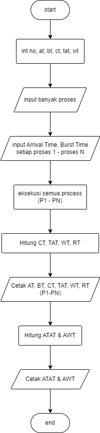
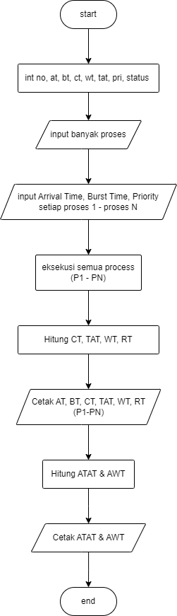
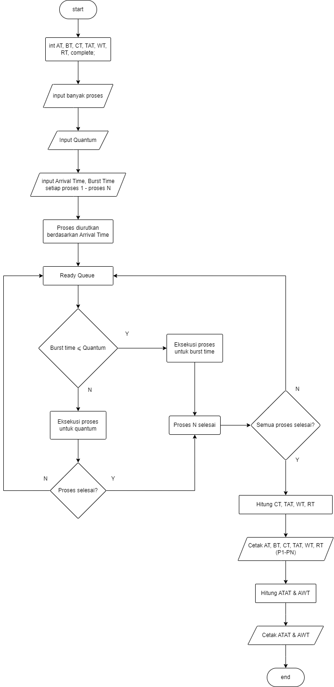

  <h1 class="text-align: center;font-weight: bold">Praktikum 11 Praktek System Operasi</h1>
  <h3 class="text-align: center;">Dosen Pengampu : Dr. Ferry Astika Saputra, S.T., M.Sc.</h3>

 

  
  <h3 style="text-align: center;">Disusun Oleh : </h3>
  

    <strong>Dewangga Wahyu Putera Wangsa (3123500007)</strong> 
    <strong>Hawa Kharisma Zahara (3123500010)</strong> 
    <strong>Bayu Ariyo Vonda Wicaksono (3122500017)</strong>
  

<h3 style="text-align: center;line-height: 1.5">Politeknik Elektronika Negeri Surabaya Departemen Teknik Informatika Dan Komputer Program Studi Teknik Informatika 2023/2024</h3>
  

### Table content

- [Scheduling-Algorithms](#scheduling-algorithms)
  - [FCFS Scheduling Algorithms](#fcfs-scheduling-algorithms)
  - [Non-Preemptive Priority Scheduling (Highest Priority First) Algorithms](#non-preemptive-priority-scheduling-highest-priority-first-algorithms)
  - [Round Robin Scheduling Algorithms](#round-robin-scheduling-algorithms)

## Scheduling-Algorithms

### FCFS Scheduling Algorithms

Analisis :

Program ini mengimplementasikan algoritma penjadwalan FCFS (First-Come, First-Served) untuk menentukan urutan eksekusi proses dalam sebuah sistem komputer. Algoritma ini sederhana, di mana proses yang datang lebih dahulu akan dijalankan terlebih dahulu.

Fungsi 'no' Nomor proses, 'at' Arrival Time (waktu kedatangan), 'bt' Burst Time (waktu eksekusi), 'ct' Completion Time (waktu penyelesaian), 'tat' Turnaround Time, dan 'wt' Waiting Time. Fungsi 'read(int i) Membaca data proses dari pengguna dan mengembalikannya sebagai struktur 'proc'.

Pengguna diminta untuk memasukkan jumlah proses 'n', data setiap proses (nomor, waktu kedatangan, dan waktu eksekusi) dibaca dari input pengguna.Proses diurutkan berdasarkan waktu kedatangan (Arrival Time - AT) menggunakan Bubble Sort. Hal ini memastikan bahwa proses yang datang lebih awal akan diproses terlebih dahulu.

Perhitungan Waktu untuk setiap proses yang diurutkan, program menghitung Completion Time (CT) Waktu saat proses selesai dieksekusi,Turnaround Time (TAT) Selisih antara waktu penyelesaian dan waktu kedatangan (CT - AT), Waiting Time (WT)Selisih antara waktu turnaround dan waktu eksekusi (TAT - BT).

### Non-Preemptive Priority Scheduling (Highest Priority First) Algorithms

Analisa :
Algoritma Highest Priority First (HPF) adalah algoritma penjadwalan yang memilih proses dengan prioritas tertinggi untuk dieksekusi terlebih dahulu. Dalam versi non-preemptive, proses yang sedang berjalan tidak akan dihentikan sampai selesai. Program ini mengimplementasikan algoritma HPF untuk menjadwalkan proses berdasarkan prioritasnya.

### Round Robin Scheduling Algorithms

Analisa :
Algoritma Round Robin (RR) adalah algoritma penjadwalan preemptive yang membagi waktu CPU secara merata di antara semua proses dalam antrian siap, menggunakan interval waktu yang disebut Time Quantum. Proses yang tidak selesai dalam Time Quantum akan ditempatkan di akhir antrian siap.
