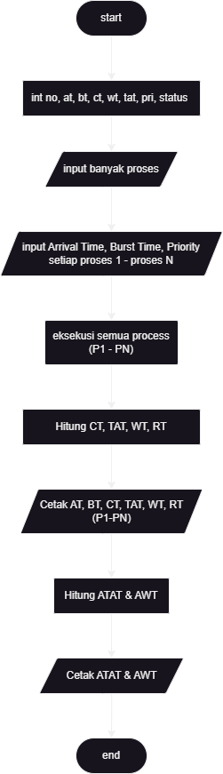

  <h1 class="text-align: center;font-weight: bold">Praktikum 11 Praktek System Operasi</h1>
  <h3 class="text-align: center;">Dosen Pengampu : Dr. Ferry Astika Saputra, S.T., M.Sc.</h3>

 

  
  <h3 style="text-align: center;">Disusun Oleh : </h3>
  

    <strong>Dewangga Wahyu Putera Wangsa (3123500007)</strong> 
    <strong>Hawa Kharisma Zahara (3123500010)</strong> 
    <strong>Bayu Ariyo Vonda Wicaksono (3122500017)</strong>
  

<h3 style="text-align: center;line-height: 1.5">Politeknik Elektronika Negeri Surabaya Departemen Teknik Informatika Dan Komputer Program Studi Teknik Informatika 2023/2024</h3>
  

### Table content

- [Scheduling-Algorithms](#scheduling-algorithms)
  - [FCFS Scheduling Algorithms](#fcfs-scheduling-algorithms)
  - [Non-Preemptive Priority Scheduling (Highest Priority First) Algorithms](#non-preemptive-priority-scheduling-highest-priority-first-algorithms)
  - [Round Robin Scheduling Algorithms](#round-robin-scheduling-algorithms)

## Scheduling-Algorithms

### FCFS Scheduling Algorithms

### Non-Preemptive Priority Scheduling (Highest Priority First) Algorithms

### Round Robin Scheduling Algorithms

