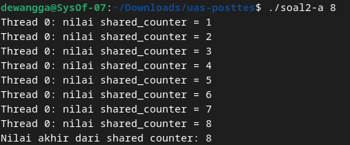
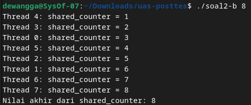

  <h1 class="text-align: center;font-weight: bold">Praktikum 11 Praktek System Operasi</h1>
  <h3 class="text-align: center;">Dosen Pengampu : Dr. Ferry Astika Saputra, S.T., M.Sc.</h3>

 

  
  <h3 style="text-align: center;">Disusun Oleh : </h3>
  

    <strong>Dewangga Wahyu Putera Wangsa (3123500007)</strong> 
    <strong>Hawa Kharisma Zahara (3123500010)</strong> 
    <strong>Bayu Ariyo Vonda Wicaksono (3122500017)</strong>
  

<h3 style="text-align: center;line-height: 1.5">Politeknik Elektronika Negeri Surabaya Departemen Teknik Informatika Dan Komputer Program Studi Teknik Informatika 2023/2024</h3>
  

### Table content

- [Tanpa Mutex](#tanpa-mutex)
- [Menggunakan Mutex](#menggunakan-mutex)

### Analisa Soal 2

#### Tanpa Mutex:

1. Pertama, user akan diminta menginputkan jumlah thread

2. setelah menerima input program akan membuat thread dan thread akan diinisialisasi dengan menggunakan fungsi phthread_create() yang mengarah ke thread_function()

3. variable shared_counter digunakan sebagai variable global yang bisa diakses dan dimodifikasi oleh setiap thread

4. karena program ini tidak memiliki sinkronisasi untuk mengamankan akses ke variable shared_counter, jadi bisa menyebabkan race condition sehingga threadnya tidak didefinisikan atau 0 dikarenakan berebut proses.

#### Menggunakan Mutex

1. Pertama, user akan diminta menginputkan jumlah thread

2. Setelah menerima input program akan membuat thread dan thread akan diinisialisasi dengan menggunakan fungsi phthread_create() yang mengarah ke thread_function()

3. variable shared_counter digunakan sebagai variable global yang bisa diakses dan dimodifikasi oleh setiap thread

4. berbeda dari program sebelumnya yang tidak menggunakan mutex, pada program ini mutex digunakan agar tidak menyebabkan race condition. Penggunaan mutex juga untuk mengontrol variable shared_counter dimana diberi inisialisasi berupa angka random seperti contoh diatas.
