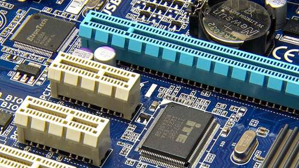
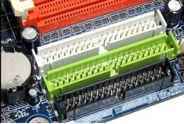

  <h1 class="text-align: center;font-weight: bold">Praktikum 2 Praktek System Operasi</h1>
  <h3 class="text-align: center;">Dosen Pengampu : Dr. Ferry Astika Saputra, S.T., M.Sc.</h3>

 

  
  <h3 style="text-align: center;">Disusun Oleh : </h3>
  

    <strong>Dewangga Wahyu Putera Wangsa (3123500007)</strong> 
    <strong>Hawa Kharisma Zahara (3123500010)</strong> 
    <strong>Bayu Ariyo Vonda Wicaksono (3122500017)</strong>
  

<h3 style="text-align: center;line-height: 1.5">Politeknik Elektronika Negeri Surabaya Departemen Teknik Informatika Dan Komputer Program Studi Teknik Informatika 2023/2024</h3>
  

## Daftar Isi

1. [Pendahuluan](#pendahuluan)
2. [Komponen Motherboard](#komponen-motherboard)

   - [Socket Prosesor](#1-socket-prosesor)
   - [Slot Memory](#2-slot-memory)
   - [Slot IDE dan Slot SATA](#3-slot-ide-dan-slot-sata)
   - [Slot AGP dan slot PCI](#4-slot-agp-dan-slot-pci)
   - [BIOS atau UEFI Chip](#5-bios-atau-uefi-chip)
   - [Battery CMOS](#6-battery-cmos)
   - [Power Connetor](#7-power-connetor)
   - [I/O Ports](#8-io-ports)
   - [Chipset](#9-chipset)

3. [Referensi](#referensi)

## Pendahuluan

Pada dasarnya, pengertian motherboard adalah papan sirkuit yang ada pada PC atau laptop untuk menghubungkan semua komponen di dalam perangkat. Mulai dari memori (RAM), prosesor (CPU), kartu video atau grafis, serta hard drive, semuanya dihubungkan melalui motherboard. Itulah mengapa, motherboard adalah perangkat keras yang disebut sebagai “ibu” atau “tulang punggung”, yaitu menjadi konektivitas semua bagian program komputer.

Sedangkan Fungsi motherboard adalah sebagai pusat penghubung antara satu perangkat keras dengan perangkat keras yang lainnya. Artinya, motherboard di sini mengembang tugas untuk menghubungkan bahasa kode antar perangkat keras untuk diintegrasikann menjadi sebuah aktivitas kerja perangkat komputer.

## Komponen Motherboard

### 1. Socket Prosesor

Komponen motherboard yang pertama adalah socket prosesor. Fungsi komponen ini adalah sebagai tempat memasang prosesor. CPU socket yang terdapat pada motherboard haruslah cocok dengan jenis prosessor yang ada. Ada beberapa jenis-jenis socket prosesor dengan fitur dan keunggulan masing-masing.

### 2. Slot Memory

Selanjutnya ada komponen slot memory. Fungsi komponen slot memory bertujuan sebagai tempat memasang RAM. Bentuk slot memory memanjang, sesuai dengan bentuk RAM itu sendiri. Posisinya bersebelahan dengan socket prosesor, pada umumnya ada lebih dari 1 slot memory agar kita bisa memasang beberapa RAM sekaligus

### 3. Slot IDE dan Slot SATA

Slot IDE dan Slot SATA merupakan dua komponen yang bentuknya beda, namun fungsinya hampir sama, yakni untuk menghubungkan harddisk atau CD/DVD-ROM ke motherboard. Keduanya memiliki bentuk sesuai kabel yang digunakan. Slot IDE sudah mulai ditinggalkan karena jarang digunakan. Kebanyakan saat ini harddisk SATA yang banyak digunakan.

### 4. Slot AGP dan slot PCI

Slot AGP dan slot PCI merupakan komponen motherboard yang berfungsi sebagai tempat graphid card atau VGA card. Saat ini penggunaan slot AGP sudah ditinggalkan karena hanya kompatibel untuk jenis VGA card yang lama. Sekrang, kebanyakan motherboard lebih banyak yang menggunakan slot PCI.

### 5. BIOS atau UEFI Chip

BIOS merupakan singkatan dari Basic Input Output System. BIOS menjadi salah satu komponen motherboard berupa chip yang berfungsi sebagai kontrol seluruh perangkat hardware pada komputer. Saat booting, BIOS memiliki peran penting. Belakangan BIOS sudah digantikan dengan UEFI, dengan fungsi sama namun teknologi yang lebih canggih.

Fungsi BIOS (Basic Input/Output System) pada Motherboard
BIOS (Basic Input/Output System) adalah firmware yang tertanam pada motherboard komputer. Ia berfungsi sebagai jembatan antara perangkat keras (hardware) dan sistem operasi (OS). BIOS berinteraksi dengan komponen hardware tingkat rendah untuk mempersiapkan sistem dan kemudian memuat sistem operasi.

Berikut beberapa fungsi utama BIOS:

1. POST (Power-On Self Test):

Ketika komputer dinyalakan, BIOS akan melakukan POST untuk memeriksa fungsionalitas dasar dari komponen hardware utama seperti CPU, RAM, dan storage. Jika ada masalah terdeteksi, BIOS akan menampilkan pesan error atau kode beep yang dapat membantu pengguna dalam mengidentifikasi masalah.

2. Booting:

BIOS bertanggung jawab untuk memuat bootloader, yang kemudian akan memuat sistem operasi dari storage device.
BIOS menentukan urutan boot device (misalnya, hard disk, CD-ROM, USB drive) dan memuat sistem operasi dari device yang diprioritaskan.

3. Konfigurasi Hardware Dasar:

BIOS menyediakan pengaturan dasar untuk hardware sistem, seperti:

- Tanggal dan waktu
- Konfigurasi RAM
- Pengaturan storage
- Pengaturan boot
- Pengaturan keamanan

4. Hardware Monitoring:

Beberapa BIOS modern memiliki fitur untuk memonitor kondisi hardware, seperti suhu CPU dan fan speed. Informasi ini dapat berguna untuk mengidentifikasi potensi masalah hardware overheating.

### 6. Battery CMOS

Battery CMOS merupakan singkatan dari Battery Complimentary Metal Oxide Semiconductor. Komponen ini berupa baterai kecil yang berfungsi untuk memberikan daya kepada BIOS. Selain itu, battery CMOS juga berfungsi untuk menyimpan setingan-setingan yang ada di dalam BIOS.

### 7. Power Connetor

Komponen motherboard berikutnya adalah power connector. Fungsi dari komponen power connector adalah untuk menghubungkan motherboard dengan power supply, komponen CPU yang penting untuk memberi daya. Konektor power ini umumnya terdiri dari dua bagian, dimana dua kabel dari power supply akan menancap di sana.

### 8. I/O Ports

Komponen motherboard yang terakhir adalah I/O ports atau input output ports. Fungsi komponen ini secara langsung berinteraksi dengan pengguna komputer. I/O ports menjadi sekumpulan ports sebagai tempat colokan untuk beragam perangkat input atau output, misalnya seperti port LAN, USB, PS/2 , VGA, dan sebagainya.

#### Fungsi I/O ports

1. Sebagai Transfer Data
   Fungsi paling dasar dari Input Output Port adalah mentransfer data dari perangkat eksternal ke perangkat utama (input) dan sebaliknya (output).
   Misalnya, ketika kita mengetik di keyboard, data dianggap sebagai input, sedangkan ketika hasil cetakan keluar dari printer, itu dianggap sebagai output.

2. Koneksi Perangkat
   Input Output Port memungkinkan koneksi fisik antara perangkat eksternal dan perangkat utama. Melalui port ini, perangkat seperti printer, monitor, atau mouse dapat terhubung dengan komputer atau perangkat elektronik lainnya.

3. Komunikasi dengan Perangkat Luar
   Input Output Port memungkinkan perangkat utama berkomunikasi dengan perangkat luar, seperti perangkat USB, ponsel pintar, kamera digital, dan perangkat lainnya.
   Dengan adanya Input Output Port, perangkat dapat berbagi data dan sumber daya dengan perangkat utama.

4. Kontrol dan Pengaturan
   Input Output Port juga berfungsi untuk mengontrol dan mengatur perangkat eksternal. Sebagai contoh, kita dapat menggunakan Input Output Port untuk mengendalikan volume speaker atau mengatur kecerahan layar monitor.

#### Macam - macam I/O ports

#### Port Parallel

Port parallel adalah port komunikasi dari komputer yang datanya dikirim dengan sistem parallel, yaitu 8 bit dikirim langsung bersama-sama dari bit 0 – bit 7. Port paraller memiliki kemampuan transfer data dengan kecepatan standart parallel port yaitu sekitar 200 kb/s. Port parallel sering digunakan pada hardware seperti printer, scanner dan proyektor.

#### Port Serial (COM 1 dan COM 2)

Kebalikan dari port parallel, pada port serial merupakan port komunikasi dari komputer yang datanya dikirim melalui sistem serial. Yaitu 8 bit dikirimi bergantian dari bit 0 sampai bit 7 . Kecepatan transfer port serial lebih rendah dibandingkan dengan kecepatan port parallel. Kabel connector COM 1 memiliki 9 pin sedangkan pada COM 2 memiliki 25 pin.

#### Port PS/2

Port ini terdapat pada komponen CPU. Biasanya port ini digunakan untuk menghubungkan keyboard dan mouse. Terdapat 2 port ps/2 pada setiap komputer dengan warna berbeda. warna untuk untuk menghubungkan keyboard dan waran hijau untuk meghubungkan mouse.

#### Port USB (Universal Serial Bus)

USB merupakan port serial universal bagi peralatan yang bekerja dengan transmisi data secara serial. Port ini biasanya digunakan untuk menghubungkan flasdisk, Mouse USB, Keyboard USB dna komponen lain yang menggunakan port usb sebagai connectornya. Port USB menghasilkan kecepatan transfer data yang sangat luar biasa dan telah mencapai versi 3.0

#### Port VGA

Port VGA tersusun atas 3 baris dan memiliki jumlah 15 pin betina (female connector) yang berguna untuk menghubungkan VGA card ke Monitor.

#### Port Audio

Port ini digunakan untuk menghubungkan perangkat seperti speaker, microphone , headset dan perangkat audio lainnya.

#### Port FDD/ IDE

Port FDD/IDE terletak pada bagian dalam motherdboard. Port ini digunakan untuk menghubungkan perangkat seperti floppy disk, Hardisk dan Sd-rom.

#### Port LAN

Port ini digunakan untuk menghubungkan perangkat komputer ke jaringan komputer lainnya sehingga terjadilah komunikasi antar komputer.

### 9. Chipset

Dalam sistem komputer, chipset biasanya terdapat pada beberapa perangkat, seperti motherboard dan kartu-kartu ekspansi seperti VGA Card. Keberadaan chipset ini layaknya “polisi lalu lintas” yang ditugaskan untuk mengarahkan aliran data dalam sebuah komputer dan menentukan perangkat apa saja yang sesuai dengan komputer tersebut.

#### Macam-macam Chipset dalam Komputer

#### 1. Chipset Northbridge

Chipset ini merupakan jenis chipset yang memiliki tugas penting dalam komputer. Tugas-tugas tersebut adalah menghubungkan processor dengan sistem memori dan graphic controller (AGP dan PCI Express) melalui bus yang berkecepatan tinggi dan juga ke southbridge.

#### 2. Chipset Southbridge

Jenis chipset selanjutnya, southbridge merupakan chipset yang berhubungan dengan peripheral melalui jalur penghubung. Tugas utama dari chipset ini adalah mengontrol bus IDE, USB, dukungan PnP (Plug and Play), penghubung antara PCI dan ISA, mengontrol keyboard dan mouse serta sebagai fitur power management pada perangkat lain. Sehingga apabila komputer mengalami masalah pada power management, kemungkinan chipset ini juga mengalami kerusakan.

## Referensi

- [Apa itu Motherboard](https://asani.co.id/blog/motherboard-adalah/)
- [Komponen Motherboard](https://www.seluncur.id/komponen-motherboard/)
- [Macam - macam I/O Ports](https://www.pro.co.id/pengertian-macam-dan-fungsi-port-input-dan-output/)
- [Fungsi I/O Ports](https://kumparan.com/ragam-info/fungsi-dari-input-output-port-beserta-pengertian-dan-jenisnya-20sMYOIg2XZ/2)
