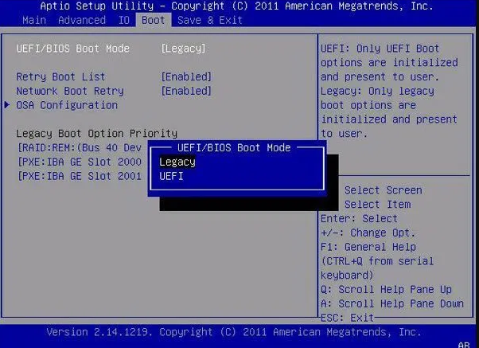

  <h1 class="text-align: center;font-weight: bold">Praktikum 2 Praktek System Operasi</h1>
  <h3 class="text-align: center;">Dosen Pengampu : Dr. Ferry Astika Saputra, S.T., M.Sc.</h3>

 

  
  <h3 style="text-align: center;">Disusun Oleh : </h3>
  

    <strong>Dewangga Wahyu Putera Wangsa (3123500007)</strong> 
    <strong>Hawa Kharisma Zahara (3123500010)</strong> 
    <strong>Bayu Ariyo Vonda Wicaksono (3122500017)</strong>
  

<h3 style="text-align: center;line-height: 1.5">Politeknik Elektronika Negeri Surabaya Departemen Teknik Informatika Dan Komputer Program Studi Teknik Informatika 2023/2024</h3>
  

## Daftar Isi

1. [Pendahuluan](#pendahuluan)
2. [Perbedaan Legacy dan UEFI](#perbedaan-legacy-dan-uefi)
3. [Referensi](#referensi)

## Pengertian BIOS

BIOS merupakan singkatan dari Basic Input Output System. merupakan suatu software (ditulis dalam bahasa assembly) yang mengatur fungsi dasar dari perangkat keras (hardware) komputer. BIOS tertanam dalam sebuah chip memory (ROM ataupun Flash Memory) berbahan Comlpimentari Metal Oxide Semiconductor (CMOS) yang terdapat pada motherboard. Sebuah baterai yang biasa disebut sebagai baterai CMOS berfungsi untuk menjaga agar tanggal dan settingan lainnya yang telah kita set pada BIOS tidak hilang atau kembali ke konfigurasi awal meskipun komputer dimatikan.

## Perbedaan Legacy dan UEFI

**1. Definisi**
Unified Extensible Firmware Interface (UEFI) adalah proses booting pada komputer modern dengan kemampuan lebih canggih dibanding sistem Legacy. UEFI menggunakan firmware URFI untuk menyimpan EFI Service Partitions saat proses booting berlangsung.
Sementara, Legacy adalah proses booting komputer dengan firmware BIOS yang lebih lama dan tradisional.

**2. Antarmuka**
UEFI mendukung penggunaan mouse bahkan touchscreen atau layar sentuh sedangkan Legacy hanya support keyboard saja.

**3. Kapasitas**
UEFI mendukung kapasitas hardisk bisa lebih dari 2 TB sedangkan bios Legacy hanya 2 TB adalah kapasitas maksimal , artinya tidak bisa lebih dari 2 TB.

**4. Keamanan**
UEFI dapat mencegah pemuatan aplikasi yang tak sah atau dicurigai. Selain itu juga dapat menghambat adanya kerja dua boot karena UEFI menganggap sistem operasi adalah aplikasi.
Namun, pada Legacy, tak ada keamanan yang disediakan saat booting berlangsung, sehingga ada kemungkinan aplikasi tak sah dimuat serta terjadi dual-boot.

## Referensi

- [Apa itu BIOS?](https://inspirasiituindaharie.wordpress.com/2021/04/02/perbedaan-antara-bios-uefi-dan-bios-legacy/)
- [Perbedaan Legacy dan UEFI](https://kumparan.com/how-to-tekno/perbedaan-uefi-dan-legacy-simak-penjelasannya-di-sini-20b8sBrgRs4/4)
