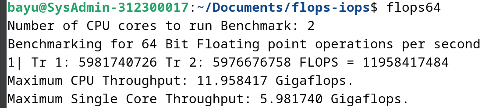
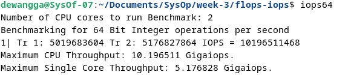
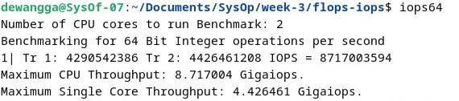
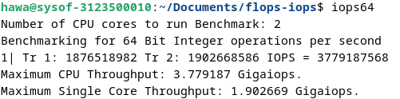

  <h1 class="text-align: center;font-weight: bold">Praktikum 3 Praktek System Operasi</h1>
  <h3 class="text-align: center;">Dosen Pengampu : Dr. Ferry Astika Saputra, S.T., M.Sc.</h3>

 

  
  <h3 style="text-align: center;">Disusun Oleh : </h3>
  

    <strong>Dewangga Wahyu Putera Wangsa (3123500007)</strong> 
    <strong>Hawa Kharisma Zahara (3123500010)</strong> 
    <strong>Bayu Ariyo Vonda Wicaksono (3122500017)</strong>
  

<h3 style="text-align: center;line-height: 1.5">Politeknik Elektronika Negeri Surabaya Departemen Teknik Informatika Dan Komputer Program Studi Teknik Informatika 2023/2024</h3>
  

## Daftar Isi

1. [PPT](#ppt)
2. [Laporan Benchmark FLOPS dan IOPS](#flops-dan-iops)
   - [Install gcc, make, dan git](#1-install-gcc-make-dan-git)
   - [Download repo dengan cara clone di GIT](#2-download-repo-dengan-cara-clone-di-git)
   - [How to Run Program FLOPS and IOPS](#3-how-to-run-program-flops-and-iops)
   - [Run program FLOPS](#4-run-program-flops)
   - [Run program IOPS](#5-run-program-iops)
   - [Tabel Pengujian](#6-tabel-pengujian)
   - [Analisa](#7-analisa)
   - [Kesimpulan](#8-kesimpulan)
3. [Referensi](#referensi)

## PPT Siklus SPU

[Link PPT](https://www.canva.com/design/DAF_FjVZneE/mGYFV4pIDyYAnDvjwu0qfg/view?utm_content=DAF_FjVZneE&utm_campaign=designshare&utm_medium=link&utm_source=editor)

## Laporan Benchmark FlOPS dan IOPS

### 1. Install GCC, make, dan GIT

### 2. Download repo dengan cara clone di Git

### 3. How to Run Program FLOPS and IOPS

ketik perintah **make** pada direktory flops-iops untuk menjalankan file **makefile**

ketik perintah **make clean** untuk me-refresh file execute yang di buat dari menjalankan file **makefile**

### 4. Run program FLOPS

- <strong>Run Program Pertama</strong>

Hasil Run Program Dewangga Wahyu

Hasil Run Program Hawa Kharisma

Hasil Run Program Bayu Ariyo Vonda

- <strong>Run Program Kedua</strong>

Hasil Run Program Dewangga Wahyu

Hasil Run Program Hawa Kharisma

Hasil Run Program Bayu Ariyo Vonda

- <strong>Run Program Ketiga</strong>

Hasil Run Program Dewangga Wahyu

Hasil Run Program Hawa Kharisma

Hasil Run Program Bayu Ariyo Vonda

- <strong>Run Program Keempat</strong>

Hasil Run Program Dewangga Wahyu

Hasil Run Program Hawa Kharisma

Hasil Run Program Bayu Ariyo Vonda

- <strong>Run Program Kelima</strong>

Hasil Run Program Dewangga Wahyu

Hasil Run Program Hawa Kharisma

Hasil Run Program Bayu Ariyo Vonda

### 5. Run program IOPS

- <strong>Run Program Pertama</strong>

Hasil Run Program Dewangga Wahyu

Hasil Run Program Hawa Kharisma

Hasil Run Program Bayu Ariyo Vonda

- <strong>Run Program Kedua</strong>

Hasil Run Program Dewangga Wahyu

Hasil Run Program Hawa Kharisma

Hasil Run Program Bayu Ariyo Vonda

- <strong>Run Program Ketiga</strong>

Hasil Run Program Dewangga Wahyu

Hasil Run Program Hawa Kharisma

Hasil Run Program Bayu Ariyo Vonda

- <strong>Run Program Keempat</strong>

Hasil Run Program Dewangga Wahyu

Hasil Run Program Hawa Kharisma

Hasil Run Program Bayu Ariyo Vonda

- <strong>Run Program Kelima</strong>

Hasil Run Program Dewangga Wahyu

Hasil Run Program Hawa Kharisma

Hasil Run Program Bayu Ariyo Vonda

### 6. Tabel Pengujian

| Nama Anggota | Max Single Core FLOPS | Max Single Core IOPS | Max CPU FLOPS | Max CPU IOPS |
| ------------ | --------------------- | -------------------- | ------------- | ------------ |
| Awang        | 5.3                   | 5.2                  | 10.5          | 10.3         |
| Hawa         | 2.2                   | 1.9                  | 4.3           | 3.8          |
| Vonda        | 6                     | 4.5                  | 11.9          | 9            |

### 7. Analisa

Dari data yang ditunjukkan oleh table diatas menunjukkan bahwa setiap laptop dengan ketidaksamaan processor menyebabkan hasil dari test FLOPS dan IOPS berbeda-beda tergantung kecepatan dari masing-masing CPU/processor.
Mulai dari **Awang** dengan spesifikasi **Processor 11th Gen Intel(R) Core(TM) i3-1115G4 @ 3.00GHz, 2995 Mhz, 2 Core(s), 4 Logical Processor(s)**, untuk spesifikasi yang ada di debian menggunakan 2 core, bisa memperoleh angka 5.3 Gigaflops dan 5.2 Gigaiops di single core dan Max CPU berada di angka 10.5 Gigaflops dan 10.3 Gigaiops.
Lalu **Hawa** dengan spesifikasi **Processor Intel(R) Celeron(R) N4000 CPU @ 1.10GHz, 1101 Mhz, 2 Core(s), 2 Logical Processor(s)**, untuk spesifikasi yang ada di debian menggunakan 2 core, bisa memperoleh angka 4.3 Gigaflops dan 3.8 Gigaiops di single core dan Max CPU berada di angka 2.2 Gigaflops dan 1.9 Gigaiops.
lalu **vonda** dengan spesifikasi **13th Gen Intel(R) Core(TM) i5-13500H, 2600 Mhz, 12 Core(s), 16 Logical Proces**, untuk spesifikasi yang ada di debian menggunakan 2 core, bisa memperoleh angka 6 Gigaflops dan 4.5 Gigaiops di single core dan Max CPU berada di angka 11.9 Gigaflops dan 9 Gigaiops.

### 8. Kesimpulan

Dari percobaan kelompok kami, bisa ditarik kesimpulan bahwa Perbandingan antara FLOPS dan IOPS mempunyai kesamaan yaitu menguji CPU untuk proses yang berhubungan dengan numberik perbedaannya ialah terdapat pada type data dari keduanya untuk FLOPS sesuai namanya Floating Operation System dan IOPS juga sesuai namanya yaitu Integer Operation System.

## Referensi

- [Apa itu CPU?](https://www.youtube.com/watch?v=Z5JC9Ve1sfI)
- [Siklus CPU](https://www.youtube.com/watch?v=jFDMZpkUWCw)
- [FLOPS dan IOPS](https://github.com/ferryastika/flops-iops)
