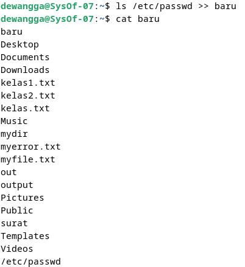

# Operasi Input Output

Referensi : [Shell Programming](https://www.geeksforgeeks.org/introduction-linux-shell-shell-scripting/?ref=shm_)

## POKOK BAHASAN:

```
* Pipeline
* Redirection
```

## TUJUAN PEMBELAJARAN:

Setelah mempelajari materi dalam bab ini, mahasiswa diharapkan mampu:

- Memahami konsep proses I/O dan redirection
- Memahami standar input, output dan error
- Menggunakan notasi output, append dan here document
- Memahami konsep _PIPE_ dan filter

## DASAR TEORI:

### 1. PROSES I/O

Sebuah proses memerlukan Input dan Output. Instruksi (command) yang diberikan pada Linux melalui Shell disebut sebagai eksekusi program yang selanjutnya disebut proses. Setiap kali instruksi diberikan, maka Linux kernel akan menciptakan sebuah proses dengan memberikan nomor PID (Process Identity). Proses dalam Linux selalu membutuhkan Input dan menghasilkan suatu Output.


Dalam konteks Linux input/output adalah :

- Keyboard (input)
- Layar (output)
- Files
- Struktur data kernel
- Peralatan I/O lainnya (misalnya Network)

## 2. FILE DESCRIPTOR

Linux berkomunikasi dengan file melalui file descriptor yang direpresentasikan melalui angka yang dimulai dari 0, 1, 2 dan seterusnya. Tiga buah file descriptor standar yang lalu diciptakan oleh proses adalah :

- 0 = keyboard (standar input)
- 1 = layar (standar output)
- 2 = layar (standar error)

Linux tidak membedakan antara peralatan hardware dan file. Linux memanipulasi peralatan hardware dengan memperlakukannya sama dengan ketika memperlakukan sebuah file.

## 3.PEMBELOKAN (REDIRECTION)

Pembelokan dilakukan untuk standard input, output dan error, yaitu untuk mengalihkan file descriptor dari 0, 1 dan 2. Simbol untuk pembelokan adalah :


## 4. PIPA (PIPELINE)

Mekanisme pipa digunakan sebagai alat komunikasi antar proses.


Proses-1 menghasilkan output yang selanjutnya digunakan sebagai input oleh Proses-2. Hubungan output input ini dinamakan `pipa ataiupipelining`, yang menghubungkan Proses-1 dengan Proses-2 dan dinyatakan dengan symbol “|”.

```
    Proses1 | Proses
```

## 5. FILTER

Filter adalah utilitas Linux yang dapat memproses standard input (dari keyboard) dan menampilkan hasilnya pada standard output (layar). Contoh filter adalah cat, sort, grep, pr, head, tail, paste dan lainnya.
Pada sebuah rangkaian pipa :

        P<sub>1</sub> | P<sub>2</sub> | P<sub>3</sub> ... | P<sub>n-1</sub> | P<sub>n</sub>

Maka P2 sampai dengan P<sub>n-1</sub> berfungsi sebagai filter. P1 (awal) dan Pn (terakhir) boleh tidak filter. Utilitas yang bukan filter misalnya who, ls, ps, lp, lpr, mail dan lainnya.
Beberapa perintah Linux yang digunakan untuk proses penyaringan antara lain :

- Perintah `grep`
  Digunakan untuk menyaring masukannya dan menampilkan baris-baris yang hanya mengandung pola yang ditentukan. Pola ini disebut regular expression.
- Perintah `wc`
  Digunakan untuk menghitung jumlah baris, kata dan karakter dari baris-baris masukan yang diberikan kepadanya. Untuk mengetahui berapa baris gunakan option –l, untuk mengetahui berapa kata, gunakan option –w dan untuk mengetahui berapa karakter, gunakan option –c.
  Jika salah satu option tidak digunakan, maka tampilannya adalah jumlah baris, jumlah kata dan jumlah karakter.
- Perintah `sort`
  Digunakan untuk mengurutkan masukannya berdasarkan urutan nomor ASCII dari karakter.
- Perintah `cut`
  Digunakan untuk mengambil kolom tertentu dari baris-baris masukannya, yang ditentukan pada option –c.
- Perintah `uniq`
  Digunakan untuk menghilangkan baris-baris berurutan yang mengalami duplikasi, biasanya digabungkan dalam pipeline dengan `sort`.

## TUGAS PENDAHULUAN:

## Jawablah pertanyaan-pertanyaan di bawah ini :

1. Apa yang dimaksud redirection?

   - Pembelokan dilakukan untuk standard input, output dan error, yaitu untuk mengalihkan file descriptor dari 0, 1 dan 2.

2. Apa yang dimaksud pipeline?

   - Suatu mekanisme pipa yang digunakan sebagai alat komunikasi antar proses.

3. Apa yang dimaksud perintah di bawah ini :
   echo, cat, more, sort, grep, wc, cut, uniq

   - `echo` : digunakan untuk menampilkan text.
     `cat` : perintah untuk melihat isi file.
     `more` : digunakan untuk membuka file satu per satu.
     `sort` : digunakan untuk mengurutkan .masukannya berdasarkan urutan nomor ASCII dari karakter.
     `grep` : digunakan untuk menyaring masukannya dan menampilkan baris-baris yang hanya mengandung pola yang ditentukan.
     `wc` : digunakan untuk menghitung jumlah baris, kata dan karakter dari baris-baris masukan yang diberikan kepadanya.
     `cut` : digunakan untuk mengambil kolom tertentu dari baris-baris masukannya,
     `uniq` : digunakan untuk menghilangkan baris-baris berurutan yang mengalami duplikasi, biasanya digabungkan dalam pipeline dengan sort.

## PERCOBAAN:

1. Login sebagai user.
2. Bukalah Console Terminal dan lakukan percobaan-percobaan di bawah ini. Perhatikan hasil setiap percobaan.
3. Selesaikan soal-soal latihan.

## Percobaan 1 : File descriptor

   <strong>
1. Output ke layar (standar output), input dari system (kernel)
   </strong>

```
$ ps
```

Hasil Output


Analisa

"$PS" digunakan untuk memperlihatkan proses yang sedang berjalan pada sistem kemudian diperlihatkan pada layar.

   <strong>

2. Output ke layar (standar output), input dari keyboard (standard input)
   </strong>

   ```
    $ cat
    hallo, apa khabar
    hallo, apa khabar
    exit dengan ^d
    exit dengan ^d
    [Ctrl-d]
   ```

   Hasil Output

   

   Analisa

   "$cat" digunakan untuk mengambil input dari keyboard dan kemudian output ditampilkan ke layar.

   <strong>

3. Input nama direktori, output tidak ada (membuat direktori baru), bila terjadi error maka tampilan error pada layar (standard error)
   </strong>

   ```
   $ mkdir mydir
   $ mkdir mydir **(Terdapat pesan error)**
   ```

   Hasil Output

   

   Analisa

   "$ mkdir" merupakan perintah yang digunakan untuk membuat direktori atau folder baru. Inputan dari mkdir adalah nama dirrektori atau folder, sedangkan untuk outputnya tidak ada saat berhasil membuat direktori atau folder baru, bila terjadi error maka outputnya adalah mencetak error yaitu "mkdir: cannot create directory 'mydir' : File exists".

## Percobaan 2 : Pembelokan (redirection)

<strong>
1. Pembelokan standar output
</strong>

```
 $ cat 1> myfile.txt
 Ini adalah teks yang saya simpan ke file myfile.txt
```

Hasil Output


Analisa

`$ 1>` merupakan salah satu metode pembelokan pengganti standar output.

<strong>
2. Pembelokan standar input, yaitu input dibelokkan dari keyboard menjadi dari file
</strong>

```
 $ cat 0< myfile.txt
 $ cat myfile.txt
```

Hasil Output


Analisa

`$ 0<` merupakan salah satu metode pembelokan standar input, yaitu input dibelokkan dari keyboard menjadi file.

<strong> 3. Pembelokan standar error untuk disimpan di file
</strong>

```
 $ mkdir mydir (Terdapat pesan error)
 $ mkdir mydir 2> myerror.txt
 $ cat myerror.txt
```

Hasil Output


Analisa

`$ 2>` merupakan metode pembelokan standar error yang kemudian disimpan kedalam file

<strong>
4. Notasi 2>&1 : pembelokan standar error (2>) adalah identik dengan file descriptor 1.
</strong>

```
 $ ls filebaru (Terdapat pesan error)
 $ ls filebaru 2> out.txt
 $ cat out.txt
 $ ls filebaru 2> out.txt 2>&
 $ cat out.txt
```

Hasil Output


Analisa

`$ 2>&1` merupakan pembelokan standar error (2>) identik dengan file descriptor 1/

<strong>
5. Notasi 1>&2 (atau >&2) : pembelokan standar output adalah sama dengan file descriptor 2 yaitu standar error
</strong>

```
$ echo “mencoba menulis file” 1> baru
$ cat filebaru 2> baru 1>&
$ cat baru
```

Hasil Output


Analisa

pembelokan standar output adalah sama dengan file descriptor 2 yaitu standar error.

<strong>
6. Notasi >> (append)
</strong>

```
$ echo “kata pertama” > surat
$ echo “kata kedua” >> surat
$ echo “kata ketiga” >> surat
$ cat surat
$ echo “kata keempat” > surat
$ cat surat
```

Hasil Output


Analisa

Notasi `>>` (append) digunakan untuk membelokkan tampilan standard output ke file tanpa menghapus isi dari file sebelumnya

<strong> 7. Notasi here document (<<++ .... ++) digunakan sebagai pembatas input dari keyboard. Perhatikan bahwa tanda pembatas dapat digantikan dengan tanda apa saja, namun harus sama dan tanda penutup harus diberikan pada awal baris
</strong>

```
$ cat <<++
Hallo, apa kabar?
Baik-baik saja?
Ok!
++
$ cat <<%%%
Hallo, apa kabar?
Baik-baik saja?
Ok!
%%%
```

Hasil Output


Analisa

Notasi here document (`<<++ .... ++`) digunakan sebagai pembatas input dari keyboard. Tanda pembatas dapat menggunakan tanda apa saja dengan syarat tanda penutup harus sama dengan tanda di awal baris, jika pada contoh diatas tanda pembatas menggunakan `++` dan `%%%`.

<strong>
8. Notasi – (input keyboard) adalah representan input dari keyboard. Artinya menampilkan file 1, kemudian menampilkan input dari keyboard dan menampilkan file 2. Perhatikan bahwa notasi “-“ berarti menyelipkan input dari keyboard
</strong>

```
$ cat myfile.txt – surat
```

Hasil Output


Analisa

Notasi `–` (input keyboard) adalah representan input dari keyboard. Artinya menampilkan file 1, kemudian menampilkan input dari keyboard dan menampilkan file 2. Perhatikan bahwa notasi `-` berarti menyelipkan input dari keyboard

## Percobaan 3 : Pipa (pipeline)

<strong>
1. Operator pipa (|) digunakan untuk membuat eksekusi proses dengan melewati data langsung ke data lainnya.
</strong>

```
$ who
$ who | sort
$ who | sort –r
$ who > tmp
$ sort tmp
$ rm tmp
$ ls –l /etc | more
$ ls –l /etc | sort | more
```

Hasil Output


Analisa

Pipeline memungkinkan pengguna menggabungkan banyak perintah dengan mudah, menggabungkan input dan output dari satu perintah ke perintah berikutnya. Memproses dan menganalisis data secara langsung tanpa menyimpannya dalam file sementara sangat bermanfaat.

<strong>
2. Untuk membelokkan standart output ke file, digunakan operator ">"
</strong>

```
$ echo hello
$ echo hello > output
$ cat output
```

Hasil Output


Analisa

Dengan menggunakan operator `>`, ubah standar output untuk disimpan ke dalam file, dan kemudian gunakan `cat` untuk mencetaknya.

<strong> 3. Untuk menambahkan output ke file digunakan operator ">>"
</strong>

```
$ echo bye >> output
$ cat output
```

Hasil Output


Analisa

Dengan menggunakan operator `>>`, Kita dapat menambahkan output ke file tanpa menghapus isi file sebelumnya.

<strong> 4. Untuk membelokkan standart input digunakan operator "<"
</strong>

```
$ cat < output
```

Hasil Output


Analisa

Dengan menggunakan operator `<`, Anda dapat membelokkan standard input, yang berarti file output akan menjadi standard input.

<strong> 
5. Pembelokan standart input dan standart output dapat dikombinasikan tetapi tidak boleh menggunakan nama file yang sama sebagai standart input dan output.
</strong>

```
$ cat < output > out
$ cat out
$ cat < output >> out
$ cat out
$ cat < output > output
$ cat output
$ cat < out >> out (Proses tidak berhenti)
[Ctrl-c]
$ cat out
```

Hasil Output


Analisa

Meskipun pembelokan standar input dan output dapat digabungkan, nama file tidak boleh sama untuk keduanya.

## Percobaan 4 : Filter

<strong> 
1. Pipa juga digunakan untuk mengkombinasikan utilitas sistem untuk membentuk fungsi yang lebih kompleks
</strong>

```
 $ w –h | grep <user>
 $ grep <user> /etc/passwd
 $ ls /etc | wc
 $ ls /etc | wc –l
 $ cat > kelas1.txt
 Badu
 Zulkifli
 Yulizir
 Yudi
 Ade
 [Ctrl-d]
 $ cat > kelas2.txt
 Budi
 Gama
 Asep
 Muchlis
 [Ctrl-d]
 $ cat kelas1.txt kelas2.txt | sort
 $ cat kelas1.txt kelas2.txt > kelas.txt
 $ cat kelas.txt | sort | uniq
```

Hasil Output


## LATIHAN:

1. Lihat daftar secara lengkap pada direktori aktif, belokkan tampilan standard output ke file baru.

Hasil Output


Analisa

Perintah pertama yang digunakan dalam latihan ini adalah `ls`, yang menampilkan daftar file, kemudian menyingkirkan output dari `ls` untuk disimpan ke dalam file baru, lalu mencetak baru.

2. Lihat daftar secara lengkap pada direktori /etc/passwd, belokkan tampilan standard output ke file baru tanpa menghapus file baru sebelumnya.
   Hasil Output

   

   Analisa

   Menggunakan `ls` untuk melihat direktori /etc/passwd, dan membelokkan outputnya ke dalam file baru tanpa mengahapus isi dari file baru sebelumnya menggunakan operator `>>`

3. Urutkan file baru dengan cara membelokkan standard input.
   Hasil Output

   

   Analisa

   Untuk mengurutkan isi file baru sesuai dengan huruf pertama, gunakan perintah sort untuk memindahkan input standar dari file baru.

4. Urutkan file baru dengan cara membelokkan standard input dan standard output ke file baru.urut.
   Hasil Output

   

   Analisa

   Untuk mengurutkan isi file baru sesuai dengan huruf pertama, gunakan perintah sort untuk membelokkan input standar dari file baru. Dalam hal ini, file baru menjadi input dari perintah sort, dan output dari perintah sort dibelokkan ke dalam file baru.urut, dan kemudian dicetak menggunakan `cat`.

5. Buatlah direktori latihan 2 sebanyak 2 kali dan belokkan standard error ke file rmdirerror.txt.

   Hasil Output

   

   Analisa

   Setelah Anda menggunakan perintah mkdir untuk membuat direktori latihan2 dua kali, akan terjadi output error. Output error tersebut dibelokkan ke dalam file rmdierror.txt menggunakan operator pembelokan error biasa, yaitu `2>`. Kemudian Anda menggunakan perintah cat untuk mencetak file rmdierror.txt.

6. Urutkan kalimat berikut :

   ```
   Jakarta
   Bandung
   Surabaya
   Padang
   Palembang
   Lampung
   ```

   Dengan menggunakan notasi **here document (<@@@ ...@@@)** . [HINT](https://www.geeksforgeeks.org/how-to-use-here-document-in-bash-programming/)

   Hasil Output

   

   Analisa

   Dengan menggunakan notasi here dalam dokumen `<@....@` dan menyimpannya ke dalam file kota.txt, gunakan perintah sort untuk mengurutkan isi file.

7. Hitung jumlah baris, kata dan karakter dari file baru.urut dengan menggunakan filter dan tambahkan data tersebut ke file baru.
   Hasil Output

   

   Analisa

   Membelokkan standard input dari `cat`, sehingga file baru.urut menjadi input untuk perintah `cat`. Lalu dengan menggunakan pipeline dilanjutkan dengan perintah `wc`untuk menghitung jumlah baris, kata dan karakter dari file baru.urut. Output dari perintah yang tadi dibelokkan menuju file baru tanpa menghapus isi dari file baru sebelumnya menggunakan operator `>>`

8. Gunakan perintah di bawah ini dan perhatikan hasilnya.

   ```
    $ cat > hello.txt
    dog cat
    cat duck
    dog chicken
    chicken duck
    chicken cat
    dog duck
    [Ctrl-d]
    $ cat hello.txt | sort | uniq
    $ cat hello.txt | grep “dog” | grep –v “cat”
   ```

Hasil Output


Analisa

Dengan menggunakan perintah `$ cat > hello.txt`, Anda membuat file baru bernama "hello.txt" yang berisi beberapa baris teks yang berisi kata-kata seperti "dog", "cat", "kuda", dan "ayam". Kemudian, dengan menggunakan perintah `$ cat hello.txt | sort | uniq`, Anda membaca isi file "hello.txt" secara alfabetis dan kemudian menggunakan uniq untuk menghilangkan setiap kata.

## Kesimpulan

Redirection, Pipeline, dan Commands yang disebutkan di atas adalah komponen penting sistem operasi UNIX/Linux dan digunakan untuk mengatur aliran data, mengatur file, dan melakukan operasi teks.

- Redirection: Dalam UNIX/Linux, proses mengalihkan aliran data standar masukan (stdin), standar keluaran (stdout), dan standar kesalahan (stderr) dikenal sebagai redirection.
- Pipeline memungkinkan pengguna mengalirkan keluaran dari satu perintah ke masukan perintah lain secara langsung tanpa menyimpannya ke dalam file sementara. Contoh penggunaan redirection adalah >, <, >>, dan 2>. Ini memungkinkan pengguna melakukan tugas yang kompleks dengan menggabungkan beberapa perintah bersama-sama. Simbol "|" menandai pipa. Misalnya, komando 1 dan komando 2 akan mengalirkan keluaran dari.
- Perintah-perintah:
  - `echo` Menampilkan teks atau variabel ke output standar.
  - `cat` Membaca isi file dan menampilkannya di output standar.
  - `more` Menampilkan isi file satu layar pada satu waktu.
  - `sort` Mengurutkan baris-baris inputnya berdasarkan urutan ASCII.
  - `grep` Mengambil inputnya dan mencari pola yang cocok, lalu menampilkan baris yang sesuai.
  - `wc` Menghitung jumlah baris, kata, dan karakter dari inputnya.
  - `cut` Memotong kolom-kolom tertentu dari inputnya.
  - `uniq` Menghilangkan baris duplikat berturut-turut dari inputnya.

## LAPORAN RESMI:

1. Analisa hasil percobaan 1 sampai dengan 4, untuk setiap perintah jelaskan tampilannya.
2. Kerjakan latihan diatas dan analisa hasilnya
3. Berikan kesimpulan dari praktikum ini.
