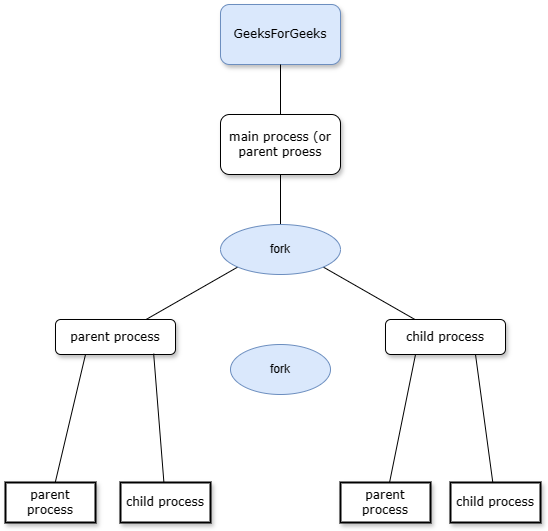

<div align="center">
  <h1 class="text-align: center;font-weight: bold">UTS<br>Praktek System Operasi</h1>
  <h3 class="text-align: center;">Dosen Pengampu : Dr. Ferry Astika Saputra, S.T., M.Sc.</h3>
</div>
<br />
<div align="center">
  
  <h3 style="text-align: center;">Disusun Oleh : </h3>
  <p style="text-align: center;">
    <strong>Dewangga Wahyu Putera Wangsa (3123500007)</strong><br>
    <strong>Hawa Kharisma Zahara (3123500010)</strong><br>
    <strong>Bayu Ariyo Vonda Wicaksono (3122500017)</strong>
  </p>

<h3 style="text-align: center;line-height: 1.5">Politeknik Elektronika Negeri Surabaya<br>Departemen Teknik Informatika Dan Komputer<br>Program Studi Teknik Informatika<br>2023/2024</h3>
  <hr><hr>
</div>

## Daftar Isi

1. [Dasar Teori](#dasar-teori)

   - [Process - Fork - Multithread](#1-fork--parent---child-process)

2. [Soal No 1](#1-buat-tulisan-tentang-konsep-fork-dan-implementasinya-dengan-menggunakan-bahasa-pemrograman-c-minimal-2-paragraf-disertai-dengan-gambar)
3. [Soal No 2](#2-deskripsikan-dan-visualisasikan-pohon-proses-hasil-eksekusi-dari-kode-program-fork01c-fork02c-fork03c-fork04c-fork05cdan-fork06c)
4. [Soal No 3](#3-buatlah-program-perkalian-2-matriks-4-x-4-dalam-bahasa-c-yang-memanfaatkan-fork)

# Dasar Teori

## Process - Fork - Multithread

Setiap program atau bagian dari program yang sedang dieksekusi oleh CPU disebut dengan proses. Proses dapat berjalan secara _foreground_ atau _background_.

Untuk melihat seluruh proses yang sedang berjalan gunakan perintah `$ ps -e` .
Bisa juga menggunakan perintah `$pstree | more` untuk melihat secara detil proses yang sefan berjalan dengan format **tree**.

Setiap proses akan memilik **PID** Process ID). Apabila dibutuhkan Sebuah proses bisa memiliki proses anakan. Dalam hubungan tersebut proses dapat diibaratkan seperti orang tua (_parent_) dengan anak (_child_) yang turun temurun.

- Setiap proses memiliki parent dan child.
- Setiap proses memiliki ID (_pid_) dan parent ID (_ppid_), kecuali proses `init` atau `systemd`.
- _ppid_ dari sebuah proses adalah ID dari parent proses tersebut.


Perhatikan, ppid dari proses `fork01` adalah pid dari proses `bash`.

**fork** digunakan untuk menduplikasi proses. Proses yang baru disebut dengan child proses, sedangkan proses pemanggil disebut dengan parent proses. Spesifikasi fork bisa dilihat dengan `$ man 2 fork`.

```
int main() {
                            pid: 2308, ppid: 10
                             [Main process]
                                 |
  fork();              > Child process created <
                                 +
                               /   \
                             /       \
               pid: 2308, ppid: 10    pid: 30, ppid: 2308
                [Parent Process]    [Child Process]

  return 0;
}
```

perhatikan bahwa :

- `pid` Parent Process == `ppid` Child
- `child_id` Parent Process == `pid` Child Process

**Exec** adalah function yang digunakan untuk menjalankan program baru dan mengganti program yang sedang berlangsung. `exec` adalah program family yang memiliki berbagai fungsi variasi, yaitu `execvp`, `execlp`, `execv`, dan lain lain.

**wait** adalah function yang digunakan untuk mendapatkan informasi ketika child proses berganti _state_-nya. Pergantian state dapat berupa _termination_, _resume_, atau _stop_.

Manual: `$ man 3 exec`

  <hr>

### 1. Buat tulisan tentang konsep **fork** dan implementasinya dengan menggunakan bahasa pemrograman C! (minimal 2 paragraf disertai dengan gambar)

Konsep fork dalam bahasa pemrograman C merupakan sebuah fitur yang memungkinkan sebuah proses untuk membuat salinan (child process) dari dirinya sendiri. Dalam implementasinya, ketika sebuah program memanggil fungsi fork(), sistem operasi akan membuat duplikat dari proses yang sedang berjalan. Proses induk (parent process) akan tetap berjalan secara normal, sementara proses baru (child process) akan memiliki identitas yang berbeda.

Child process akan mewarisi semua data dari proses induk, termasuk kode program dan semua variabel. Namun, kedua proses tersebut akan memiliki ruang alamat memori yang terpisah, sehingga perubahan yang terjadi pada salah satu proses tidak akan memengaruhi yang lain.

Gambar



Source Code

    #include <sys/types.h>

    #include <unistd.h>
    #include <stdio.h>

    int main()
    {
    pid_t child_id;
    printf("This is the main program, with PID = %d, Child's ID = %d, Parent ID = %d\n",
    (int) getpid(), (int) child_id, (int) getppid());

        child_id = fork();
        if(child_id != 0){
          printf("This is the parent process, with PID = %d, Child's ID = %d, Parent ID = %d\n",
          (int) getpid(), (int) child_id, (int) getppid());
        } else {
          printf("This is the child process, with PID = %d, Child's ID = %d, Parent ID = %d\n",
          (int) getpid(), (int) child_id, (int) getppid());
        }

    }

Output


Analisa : Program diatas merupakan salah satu contoh implementasi fungsi `fork()` dalam bahasa pemrogramman C dimana program tersebut mencetak PID, Child ID, dan PPID (Parent Process ID) pada main program dipanggil PID yang tertera 4992 dan parent ID 4978. Main program lalu menggunakan fungsi `fork()` lalu ditampilkan dengan keterangan parent process dan child process, dengan masing masing mempunyai PID dan PPID. Untuk parent process mempunyai PID = 4992 dan PPID = 4978 yang mana sama dengan main process, lalu untuk child process mempunyai PID = 4993 dan PPID = 4992 dengan PID yang jelas lebih besar dibandingkan parent process.

### 2. Deskripsikan dan visualisasikan pohon proses hasil eksekusi dari kode program `fork01.c`, `fork02.c`, `fork03.c`, `fork04.c`, `fork05.c`dan `fork06.c`.

- `fork01.`

Source Code:


Output:


Visualisasi:

```
int main() {
  for(int i = 0;i < 3; i++){
    PID : 3185, PPID : 2208, uid : 1000
              [Main Process]
                    |
                sleep(3)
                    |
    PID : 3185, PPID : 2208, uid : 1000
              [Main Process]
                    |
                sleep(3)
                    |
    PID : 3185, PPID : 2208, uid : 1000
              [Main Process]
                    |
                sleep(3)
  }
}
```

Analisa: Output diatas terlihat bahwa program sedang melakukan proses forking secara berulang, menghasilkan banyak proses anak dengan identitas yang berbeda-beda. Setiap proses mencatat ID prosesnya (PID) dan ID proses induknya (PPID), di samping ID pengguna (uid) yang sama untuk pemilik proses. Ini menggambarkan perilaku khas dari panggilan sistem "fork", di mana sistem operasi membuat salinan dari proses yang sedang berjalan.

- `fork02.`

Source Code:


Output:


Visualisasi:

```
int main() {
  fork();         > Child process created <
                              +
                            /   \
                          /       \
                        /           \
  while(1){           /               \
          PID: 3262, PPID: -       PID: 3263, PPID: 3262
          [Parent Process]          [Child Process]
                      \               /
                        \           /
                          \       /
                            \   /
                              |
                          sleep(2)
                              |
                             x++
  }
}
```

Analisa: Output tersebut menunjukkan bahwa program ini menggunakan panggilan sistem fork untuk membuat proses anak. Setiap proses anak memiliki nilai variabel "x" sendiri yang berbeda dari proses lainnya.

- `fork03.`

Source Code:


Output:


Visualisasi:

```
int main() {
      fork();         > Child Process created <
                              +
                            /   \
                          /       \
  x=5;                  /           \
  while(x<=5){        /               \
          PID: 3262, PPID: -      PID: 3263, PPID: 3262
          [Parent Process]          [Child Process]
                      \               /
                        \           /
                          \       /
                            \   /
                              |
                          sleep(2)
                              |
                            x++
  }
}
```

Analisa: Output diatas melakukan proses forking secara berulang, menghasilkan proses-proses baru dengan pesan yang mencatat ID proses (PID) masing-masing. Adanya beberapa PID yang berulang menandakan bahwa proses induk melakukan fork beberapa kali, menghasilkan proses-proses anak dengan PID yang sama.

- `fork04.`

Source Code:


Output:


Visualisasi:

```
int main() {
  fork();               > Child process created <
                                    +
                                  /   \
                                 /     \
                                /       \
                               /         \
                    PID: 3408, PPID: -    \
                    [Parent Process]       \
                            |               \
                            |                \
                            |        PID: 3409, PPID: 3408
                          wait         [Child Process]
                            \                /
                              \            /
                                \        /
                                  \    /
                                    \/
                                   exit
}
```

Analisa: Program tersebut melakukan proses forking untuk menciptakan proses anak. Proses induk mencetak pesan yang menunjukkan identitasnya, yaitu "I am the parent and my pid = 3408", di mana 3408 adalah PID dari proses induk itu sendiri. Sementara proses anak mencetak pesan "My parent is 3408" diikuti dengan PID-nya sendiri, yaitu "I am a child and my pid = 3409". Keduanya kemudian mencetak pesan yang serupa. Proses anak kemudian memberikan pesan penutup "I am a child and I am quitting work now!" untuk menandakan berhentinya prosesnya. Proses induk menyusul dengan mencetak pesan "I am the parent and I am quitting".

- `fork05.`

Source Code:


Output:


Visualisasi:

```
int main() {
  fork();                > Child process created <
                                    +
                                  /   \
                                /       \
                PID : 3495 PPID : -       \
                 [Parent Process]           \
                        |                     \
                        |                       \
                        |               PID : 3496 PPID : 3495
                      wait                    execl(/bin/ls)
                        \                     [Child Process]
                          \                       /
                            \                   /
                              \               /
                                \           /
                                  \       /
                                    \   /
                                      |
                                    exit
}
```

Analisa: Program diatas adalah program implementasi `fork()` dengan dua proses yang menghubungkan parent dan child. Proses pertama memiliki PID: 3495 dan PPID yang tidak diketahui, yang merupakan proses utama (main program atau parent). Setelah program menjalankan fungsi fork(), akan muncul proses baru dengan PID: 3496 dan PPID: 3495. Setelah parent program memberikan output yang menunjukkan nomor PID dan PID child, parent program akan menunggu atau menunggu anak berjalan. Setelah anak berjalan dan memberikan output yang menunjukkan nomor PID dan PID anak, parent program akan langsung keluar dari proses. Setelah anak keluar dari proses, parent program juga akan keluar dari proses.

- `fork06.`

Source Code:


Output:


Visualisasi:

```
int main() {
  fork();           > Child process created <
                                +
                              /   \
                            /      \
              PID: 3541, PPID: -    \
              [Parent Process]       \
                      |               \
                      |          PID: 3542, PPID: 3541
                    wait          [Child Process]
                      \               /
                        \           /
                          \       /
                            \   /
                              |
                            exit
}
```

Analisa: Proses induk mencetak pesan yang menyatakan identitasnya sebagai "I am the parent and my pid = 3541", di mana 3541 adalah PID dari proses induk itu sendiri. Sementara itu, proses anak mencetak pesan "My parent is 3541" diikuti dengan PID-nya sendiri, yaitu "I am a child and my pid = 3542". Keduanya juga mencetak pesan yang menunjukkan bahwa mereka adalah proses yang sehat dan bahagia dengan PID masing-masing. Kemudian, kedua proses terus mencetak pesan "This is process XXXX", di mana XXXX menunjukkan PID masing-masing proses, menunjukkan iterasi dalam siklus kerjanya. Akhirnya, proses induk mengakhiri eksekusinya dengan mencetak pesan "I am the parent and I am quitting.".

### 3. Buatlah program perkalian 2 matriks [4 x 4] dalam bahasa C yang memanfaatkan `fork()`.

Source Code


Output


Analisa : kode diatas merupakan sebuah program perkalian 2 matriks [4 x 4] dalam bahasa C yang memanfaatkan fork().

Proses Fork: Setelah inisialisasi matriks, program melakukan fork untuk membuat proses anak. Proses anak akan mengalikan setiap elemen matriks dengan skalar, sementara proses induk menunggu proses anak selesai.

Pemrosesan Serial: Meskipun perkalian skalar dilakukan secara paralel oleh proses anak, program menunggu proses anak selesai sebelum melanjutkan eksekusi. Ini dilakukan dengan menggunakan fungsi wait(), sehingga proses induk akan menunggu sampai proses anak selesai sebelum mencetak pesan bahwa proses induk telah selesai.
