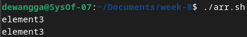
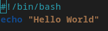
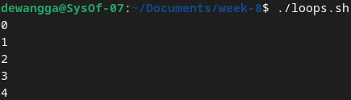
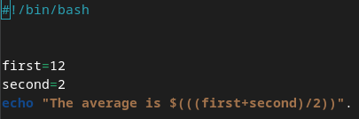
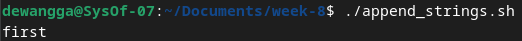
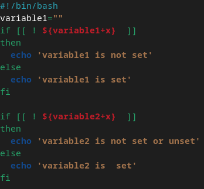

<div align="center">
  <h1 class="text-align: center;font-weight: bold">Praktikum 8<br>Praktek System Operasi</h1>
  <h3 class="text-align: center;">Dosen Pengampu : Dr. Ferry Astika Saputra, S.T., M.Sc.</h3>
</div>
<br />
<div align="center">
  
  <h3 style="text-align: center;">Disusun Oleh : </h3>
  <p style="text-align: center;">
    <strong>Dewangga Wahyu Putera Wangsa (3123500007)</strong><br>
    <strong>Hawa Kharisma Zahara (3123500010)</strong><br>
    <strong>Bayu Ariyo Vonda Wicaksono (3122500017)</strong>
  </p>

<h3 style="text-align: center;line-height: 1.5">Politeknik Elektronika Negeri Surabaya<br>Departemen Teknik Informatika Dan Komputer<br>Program Studi Teknik Informatika<br>2023/2024</h3>
  <hr><hr>
</div>

## Daftar Isi

[1. Bash Tutorial](#1-bash-tutorial)

[2. Bash Variable](#bash---variable)

[3. Bash Loop File](#bash---loop-file)

[4. Bash Comments](#bash---comments)

[5. Bash Arrays](#bash---arrays)

[6. Bash Expansion](#bash---expansion)

[7. Bash Conditional Expression](#bash---conditional-expression)

[8. Bash Case Statement](#bash---case-statements)

[9. Bash Special Character](#bash---special-characters)

[10. Bash If elif else](#bash---if-elif-else)

[11. Bash Loops](#bash---loops)

[12. Bash Append Strinng](#bash---append-string)

[13. Bash Functions](#bash---functions)

[14. Bash Append Strings](#bash---append-string-1)

[15. Bash Operators](#bash---operators)

[16. Bash Number Comparation](#bash---numbers-comparasion)

[17. Bash Check Directory](#bash---check-directory)

[18. Bash File Name](#bash---file-name)

[19. Bash Split String](#bash---split-string)

[20. Bash String Length](#bash---string-length)

[21. Bash bashrc](#bash---bashrc)

[22. Bash Ternary Operator](#bash---ternary-operator)

[23. Bash Lowercase](#bash---lowercase)

[24. Bash Uppercase](#bash---uppercase)

[25. Bash Substring](#bash---substring)

[26. Bash Variable Set](#bash---variable-set)

[27. Bash Iterate Nos](#bash---iterate-nos)

## **Bash Tutorial**

**Apa itu Bash?**

Ada dua jenis mode bash

- Mode interaktif: Juga disebut penerjemah perintah, memungkinkan eksekusi perintah di terminal. Ini mengeksekusi perintah secara berurutan jika ada beberapa perintah.
  **Shell Types**

Ada berbagai jenis shell di OS Unix.

| Shell Type | Alias              | First Line  |
| ---------- | ------------------ | ----------- |
| sh         | Bourne Shell       | #!/bin/sh   |
| bash       | Bourne Again shell | #!/bin/bash |
| cshell     | C shell            | #!/bin/csh  |

**Apa perbedaan antara Bash dan shell**

Shell adalah penerjemah baris perintah, Ini adalah aplikasi untuk memberikan perintah ke berbagai sistem operasi seperti Linux, Unix, dan Mac.

Bash adalah versi shell yang disempurnakan, lapisan antara panggilan fungsi pengguna dan sistem operasi.

**Apakah bash bahasa pemrogramman?**

Bash menjalankan perintah dari terminal atau file. Ini adalah bahasa pemrograman yang beroperasi pada sistem operasi kernel Unix/Linux, berisi semua fitur untuk menulis kode lengkap.

Bash adalah tipe shell khusus yang menerima masukan dari perintah, menjalankan kode, dan memproses masukan, serta mengembalikan hasilnya.

Skrip Bash memiliki banyak kasus penggunaan, termasuk:

b. Menyinkronkan tugas untuk menyalin file

c. Menjalankan tugas cron untuk penjadwalan

## Bash - Variable

Deklarasikan variabel: Untuk membuat variabel, harus memberikan nilai pada variable tersebut.


pada gambar diatas `variableName` : Ini adalah nama variabel, yang dapat berisi kombinasi huruf apa saja (a sampai z, A sampai Z), angka (0 sampai 9), dan garis bawah (\_).

VariableValue adalah nilai yang disimpan dalam variabel, dan dapat berupa string angka atau boolean. Simbol sama dengan (=) digunakan untuk memberikan nilai pada suatu variabel.

example: `AGE=25`

Variabel bernama AGE dibuat dan diberi nilai 25.

**Cara Mengakses Variabel di Bash**

Setelah mendeklarasikan dan menetapkan nilai ke variabel, Anda dapat mengaksesnya menggunakan simbol dolar ($) diikuti dengan nama variabel.

Syntax :


Output :


Kode di atas mendeklarasikan variabel bernama AGE dengan nilai 25 dan kemudian menggunakan echo untuk menampilkan nilai variabel AGE. Simbol dolar sebelum nama variabel sangat penting untuk mengakses nilainya.

Bagaimana Anda membuat variabel tidak dapat diperbarui?

Syntax :


AGE adalah sebuah batasan, menetapkan nilai baru akan menimbulkan kesalahan, dan pesan kesalahannya adalah AGE: bersifat hanya-baca.

Output :


**Variabel Bash tidak disetel**

Kata kunci yang tidak disetel membantu menghilangkan nilai dari variabel yang ditentukan. Variabel tetap dapat diakses tetapi mencetak nilai kosong.

Syntax :


output:


**Lingkup Variabel**

Setiap variabel yang dideklarasikan harus memiliki ruang lingkup, yang menentukan di mana variabel tersebut dapat digunakan dalam program.

Misalnya, jika suatu variabel dideklarasikan di dalam suatu fungsi, maka variabel tersebut hanya tersedia di dalam fungsi tersebut dan tidak dapat diakses di luar fungsi tersebut.

Cakupan variabel di Bash dapat didefinisikan dengan dua cara, yaitu:

- Variabel global
- Variabel lokal

**Variabel Global Bash**

Syntax :


Output: `Inside Function Age: 40
Script Age: 40`

**Bash variabel Lokal**

Variabel lokal dideklarasikan di dalam blok kode atau fungsi. Cakupan variabel-variabel ini hanya terlihat di dalam blok tempat variabel-variabel tersebut dideklarasikan.

Syntax :


Dalam sintaks ini, variabel dideklarasikan dan ditetapkan dengan kata kunci lokal.

Syntax :


Output :
`Local Variable Age: 25
Global Age: 40`

**Variable Typing**
Skrip Bash bukan bahasa yang diketik, namun Anda dapat mendeklarasikan variabel dengan tipe data menggunakan perintah mendeklarasikan Berdasarkan tipe variabel, ini memungkinkan tipe data.
variabel dideklarasikan dan diberi nilai.

Opsi berisi opsi untuk membuat tipe variabel

Array: Untuk membuat variabel array

mendeklarasikan -a variabel=

| Variable Type    | Syntax                | Description                                                      |
| ---------------- | --------------------- | ---------------------------------------------------------------- |
| Array            | `declare -a variable` | Declare an indexed array variable that stores strings            |
| Associated Array | `declare -A variable` | Declare an Associated Array                                      |
| Integer          | `declare -i variable` | Declare a numeric value to store in the variable                 |
| Readonly         | `declare -r variable` | Declare a readonly variable, cannot be changed or unset          |
| Export           | `declare -x variable` | Export the variable and make it available to all child processes |

**Shell Variable**

Variabel shell adalah variabel yang diatur oleh shell, bukan oleh pengguna. Ini diperlukan oleh shell agar dapat bekerja dengan lancar

| Variable     | Description                                                                        |
| ------------ | ---------------------------------------------------------------------------------- |
| PWD          | Current working directory                                                          |
| Set-Location | Change the working directory to new directory                                      |
| Rename-Item  | Rename a file                                                                      |
| IFS          | Internal Field Separator, by default is space, set by Shell, Used for string split |
| PATH         | Contains semicolon separated path of commands, Configured to lookup for commands   |
| UID          | Prints the User Identification number                                              |
| Home         | Home directory of the current user                                                 |

## Bash - Loop File

Terkadang, Anda ingin membaca konten file dengan pemrograman bash.

Bagaimana cara membaca file baris demi baris di bash Shell?

Syntax :


Output :


## Bash - Comments

- Komentar tunggal
- Komentar multi-baris

Komentar berguna bagi manusia, kode ditulis untuk scripting

**Komentar satu baris di bash shell**

Penting untuk menempatkan omentar satu baris pada baris terpisah untuk kejelasan.

Untuk komentar sebaris, gunakan simbol # di awal komentar. Komentar satu baris selalu dimulai dengan simbol #.

Syntax :


Output :


Komentar multi-baris melibatkan penggunaan lebih dari satu baris untuk komentar. Cara pertama untuk membuat komentar multi-baris adalah dengan memanfaatkan komentar satu baris yang setiap barisnya dimulai dengan simbol komentar satu baris.

Syntax :


Output :


## Bash - Arrays

Array di shell adalah variabel yang menyimpan lebih dari satu nilai.
Misalkan, Anda memiliki daftar nomor 1 2 3.. 10 dan ingin menyimpan nomor-nomor ini di Shell Script

Tanpa array, Anda harus mendeklarasikan sebagai berikut

Syntax :


Bagaimana cara mendeklarasikan dan membuat array?

Ada dua jenis array yang bisa kita buat

- array yang diindeks: elemen array disimpan dengan indeks mulai dari nol
- array terkait: array disimpan dengan pasangan nilai kunci

**Deklarasikan sebuah array**

Untuk membuat array, kita perlu mendeklarasikan sebuah array.


Sebuah indexed array dengan kata kunci mendeklarasikan dengan opsi -a atau A

Contoh array yang diindeks Dalam hal ini, nilai Array disimpan dengan indeks=0 dan seterusnya. ini dibuat dengan opsi deklarasi dan -a


Contoh array asosiatif Dalam hal ini, nilai Array disimpan dengan kunci. ini dibuat dengan opsi deklarasi dan -A


Mari kita tetapkan nilainya.


Tetapkan nilai tanpa mendeklarasikan array


**Akses nilai array**
Array berisi indeks untuk mendapatkan elemen. Elemen array dapat diakses menggunakan sintaks di bawah ini.

    ${array_name[index]}

**Deklarasikan Array angka dan ulangi**

Array dapat berisi angka Contoh ini berisi array angka dan loop for untuk dicetak

Syntax :


Output :


**Deklarasikan Array string dan ulangi**
Array dapat berisi angka Contoh ini berisi array angka dan loop for untuk dicetak

Syntax :


Output :


**Akses elemen pertama array**

Dalam elemen Array, indeks elemen Pertama adalah nol, dan array[0] mengembalikan elemen pertama

Syntax :


Output :


**Dapatkan elemen terakhir dari sebuah array**

Syntax :


Output :



**Ulangi atau ulangi elemen array**

For loop digunakan untuk mengulangi elemen.
Berikut adalah contoh contoh loop array untuk mencetak semua elemen

Syntax :


Output :


Cara lain untuk mencetak indeks dan elemen array menggunakan for loop

Syntax :


Output :


**Cetak semua elemen array**

Gunakan [@] atau [*] untuk mencetak semua elemen array

Syntax :


Output :


**Hapus elemen dari array**

Anda dapat menghapus elemen dari array menggunakan unset untuk indeks tertentu.

Syntax :


Output :


**Menambahkan elemen ke array**

Anda dapat menambahkan elemen di posisi indeks mana pun menggunakan sintaksis di bawah ini.

Contoh penambahan elemen awal dan akhir serta tengah
Syntax :


Output :


**Panjang sebuah array**

Dalam hal ini, Temukan jumlah semua elemen dalam array.

Skrip shell menyediakan #

Syntax :


Output :


Contoh lembar contekan array

| Contoh                | Deskripsi                                                       |
| --------------------- | --------------------------------------------------------------- |
| declare -a array      | Mendeklarasikan sebuah array yang diindeks                      |
| declare -A array      | Mendeklarasikan sebuah array asosiatif                          |
| declare -a array=()   | Mendeklarasikan sebuah array yang diindeks dengan array kosong  |
| array=()              | Membuat sebuah array kosong, tanpa mendeklarasikannya           |
| array=(1 6 3)         | Menginisialisasi array dengan angka                             |
| array=(satu dua tiga) | Menginisialisasi array dengan string                            |
| array=(satu dua 1)    | Menginisialisasi array dengan data campuran                     |
| ${array[0]}           | Mendapatkan elemen pertama dari array                           |
| ${array[1]}           | Mendapatkan elemen kedua dari array                             |
| ${array[-1]}          | Mendapatkan elemen terakhir dari array                          |
| ${array[@]}           | Mendapatkan semua elemen dari array                             |
| ${array[*]}           | Mendapatkan semua elemen dari array                             |
| ${!array[*]}          | Mendapatkan semua indeks dari array                             |
| ${#array[*]}          | Panjang array                                                   |
| array[0]=12           | Menambahkan elemen ke array pada posisi pertama, yaitu indeks=0 |
| array[-1]=22          | Menambahkan elemen ke array pada posisi terakhir                |
| array+=(11)           | Menambahkan nilai ke array                                      |
| ${array[@]:k:i}       | Mendapatkan elemen indeks=1 dimulai dari indeks=k               |

## Bash - expansion

perintah dimasukkan ke OS untuk membuat panggilan sistem dan melakukan tindakan. perintah masukan pengguna di terminal untuk melakukan operasi seperti ls, cd, mkdir dll.

Cara lain, Beberapa perintah dapat ditempatkan dalam satu file, juru bahasa bash membaca perintah dan menjalankannya

Pilih Editor atau editor teks
Buat file dengan ekstensi .sh atau .bash
Tulis perintah dalam file
Simpan file sebagai `expansion.sh`

Syntax :



Output :


## Bash - Conditional Expression

in

Ada berbagai jenis ekspresi konisional di Bash

- Operator Perbandingan String
- Operator Perbandingan Numerik
- Operator File
- Operator Logis

**File Operators**

Bash menyediakan operator logika pada FIle dan direktori untuk menguji ekspresi kondisional. Ini memungkinkan Anda untuk memeriksa berbagai operasi seperti keberadaan, dan izin, ukuran. Ini digunakan ekspresi kondisional dalam pernyataan kondisional seperti if else dan case.

Syntax :


conditiona_expressions berisi opsi, dan jalur file, yang selalu mengembalikan nilai benar atau salah.

berikut adalah opsi yang disediakan

| Operator        | Deskripsi                                                                                                 |
| --------------- | --------------------------------------------------------------------------------------------------------- |
| -e file         | Mengembalikan nilai true jika file yang diberikan ada, di mana file bisa berupa file biasa atau direktori |
| -f file         | Mengembalikan nilai true jika file yang diberikan ada dan merupakan sebuah file (bukan direktori)         |
| -d file         | Mengembalikan nilai true jika file adalah sebuah direktori                                                |
| -r file         | Mengembalikan nilai true jika file ada dan memiliki izin baca                                             |
| -w file         | Mengembalikan nilai true jika file ada dan memiliki izin tulis                                            |
| -x file         | Mengembalikan nilai true jika file ada dan memiliki izin eksekusi                                         |
| -s file         | Mengembalikan nilai true jika file ada dan ukurannya tidak kosong                                         |
| -G file         | Mengembalikan nilai true jika file ada dan dimiliki oleh sebuah ID Grup yang cocok                        |
| -O file         | Mengembalikan nilai true jika file ada dan dimiliki oleh sebuah ID Pengguna yang cocok                    |
| -N file         | Mengembalikan nilai true jika file ada dan telah dimodifikasi sejak baca terakhir                         |
| -L file         | Mengembalikan nilai true jika file ada dan merupakan sebuah tautan simbolik                               |
| file1 -ot file2 | Mengembalikan nilai true jika file1 lebih tua dari file2, atau jika file2 ada dan file1 tidak ada         |
| file1 -ne file2 | Mengembalikan nilai true jika file1 lebih baru dari file2, file1 ada, dan file2 tidak ada                 |
| file1 -ef file2 | Mengembalikan nilai true jika file1 dan file2 menunjuk ke perangkat dan inode yang sama                   |

## Bash - Case Statements

Pernyataan case mirip dengan switch case dalam bahasa pemrograman lain.
Ini digunakan untuk membandingkan masukan yang diberikan dengan beberapa pola, dan perintah di dalam pola yang cocok dijalankan.

Syntax :


- ekspresi adalah variabel atau ekspresi yang valid untuk dievaluasi
- Ini berisi pola defiend di dalam case yang dievaluasi dengan membandingkan ekspresi, mencocokkan case fuound, mengeksekusi perintah di dalamnya.
- default case(\*)) untuk dieksekusi jika tidak ada pola yang cocok
- Setiap blok pola diakhiri dengan ;;
- case adalah kata awal dan esac adalah kata yang mengakhiri pernyataan case

Ini sebuah contoh

Syntax :


Output:


## Bash - Special Characters

Karakter khusus di bash dievaluasi dengan arti khusus dalam interpretasi suatu perintah. Karakter-karakter ini memiliki instruksi khusus, penggunaan karakter ini memiliki arti berbeda dalam konteks berbeda
**Blankspace(" "):**
Ini juga disebut spasi putih, berisi tab, spasi, kembali, baris baru. Ini memberitahu penerjemah bash untuk memisahkan perintah dan konten. Ini adalah pembatas untuk memisahkan perintah dan string.

Syntax :


Output:


Contoh di atas, echo adalah perintah yang diikuti spasi, dan string berisi spasi untuk kata.

**Expansion($)**

Simbol tanda dolar digunakan untuk berbagai jenis perluasan parameter perluasan, ($variabel, ${variabel}) Substitusi ($(ekspresi)) ekspresi artema ($((ekspresi)))

**Ambersand(&)**

Menambahkan & di akhir perintah memungkinkan Anda menjalankan perintah di latar belakang.


**Single quotes**

Single quotes (') are used to define a string without a special meaning. It means all the variables and expansion are not interepreted and print the same literal string

Syntax :


Output :


Jika kutipan tunggal berisi kutipan tunggal bersarang, Anda harus menghindarinya menggunakan ```.

Syntax :


Output :


**Double qoutes**

Tanda kutip ganda (') digunakan untuk mendefinisikan string literal dengan arti khusus.

jika string berisi variabel dan sintaks perluasan, Ini diinterprestasikan dan diperluas, dengan nilai yang dievaluasi saat runtime.

jika string tidak ingin memperluas variabelnya, maka Anda dapat keluar dari \ sebelum simbol $ dolar

Syntax :


Output :


**Backslash Character( \ )**

Karakter garis miring terbalik digunakan untuk keluar dari karakter dalam string. ini digunakan dalam string yang dikutip ganda.

Syntax :


Output :


**Comment ( # )**

Simbol komentar digunakan untuk mengomentari sebaris kode. Baris komentar selalu dimulai dengan #.
Itu diabaikan oleh penerjemah bash.

Syntax :


Output :


## Bash - if elif else

Skrip Bash menyediakan ekspresi kondisional untuk mengeksekusi kode berbeda berdasarkan kondisi yang ditentukan.

**Pernyataan Bersyarat Bash Shell**
Terkadang, Anda mungkin perlu mengeksekusi beragam blok kode bergantung pada berbagai keputusan berdasarkan kondisi tertentu.

Skrip Bash memfasilitasi hal ini melalui pernyataan kondisional


**If Conditional Statements**

Pernyataan if di Bash digunakan untuk mengeksekusi blok kode ketika kondisi yang ditentukan benar.


example

Syntax :


Output:


**If-Else Conditional Statements**

Pernyataan kondisional if-else di Bash memungkinkan Anda mengeksekusi blok kode yang berbeda bergantung pada apakah suatu kondisi benar atau salah.


example

Syntax :


Output :


**If..Elif..Else Statements**

Gunakan pernyataan kondisional if..elif..else di Bash untuk mengeksekusi blok kode yang berbeda berdasarkan beberapa kondisi.


example

Syntax :


Output :


## Bash - Loops

Loop digunakan untuk mengeksekusi blok kode beberapa kali.

Misalkan Anda ingin menjalankan perintah berulang kali atau mencetak array.for loop digunakan di Bash

- for loop
- for index loop
- while loop
- until loop

**For Loop**

for loop digunakan untuk mengeksekusi kode beberapa kali berdasarkan


example

Syntax :


Output :


**For index loop**

untuk loop indeks mirip dengan bahasa C untuk loop indeks. Ini mengeksekusi kode beberapa kali berdasarkan kondisi benar, Ini dimulai dengan nilai awal dan iterasi berisi nilai yang akan bertambah 1.


example

Syntax :


Output :



**While Loop**

Perulangan while di Bash memungkinkan eksekusi kode berulang selama kondisi yang ditentukan benar. Jika kondisi menjadi salah, perulangan akan keluar.

Struktur dasar perulangan while adalah sebagai berikut:


example

Syntax :


Output :


**Until Loop**

Kata kunci sampai di Bash digunakan untuk mengeksekusi kode berulang kali hingga kondisi yang ditentukan menjadi benar, di mana loop keluar.

Struktur dasar dari perulangan sampai adalah sebagai berikut.


example

Syntax :


Output :


## Bash - Append String

**Bash Athematic expressions**

Ekspresi artema digunakan untuk melakukan operasi matematika

ekspresi adalah istilah yang digunakan dalam matematika untuk menunjukkan suatu operasi. Ini berisi operan dan operator untuk melakukan operasi matematika. `a<b` adalah ekspresi. Ini mungkin berisi operator biner atau unary Di bash, Ekspresi dibuat menggunakan tanda kurung (()) dengan operan dan operator sebagai argumen. ((a)) adalah ekspresi bash.

Syntax :


ekspresi adalah operasi matematika, Dapat berisi sub ekspresi yang dipisahkan dengan koma.

Syntax :


Output :


Ekspresi artema dibuat menggunakan operator di bawah ini

- Operator Artmatik
- Operator Perbandingan

Operator perbandingan digunakan untuk mengecek satu sama lain dengan membandingkan nilai Operator (<, <=, >, >=, ==, !=)

Syntax :


Output :


- Operator Logis
- Pernyataan bersyarat

**Bash Athematic Expansion**

Ekspansi sama dengan ekspresi, Ekspansi menghitung nilai ekspresi dan hasilnya diganti dengan nilai. Itu selalu diawali dengan tanda dolar.


Misalnya menghitung rata-rata dua angka, cetak hasilnya. Di sini digunakan sintaks ekspansi, Ini mengevaluasi ekspresi dan hasilnya diganti dengan output ekspresi.

Syntax :



Output :


## Bash - Functions

Fungsi adalah kode yang dapat digunakan kembali dan dikelompokkan dalam satu nama. Mendeklarasikan suatu fungsi Memanggil Fungsi Fungsi dengan argumen Cakupan variabel dalam Fungsi

**Bagaimana mendeklarasikan suatu Fungsi dan memanggilnya**

Definisi fungsi berisi beberapa baris kode yang akan dieksekusi.

Fungsi berisi nama fungsi yang diapit {}.

Itu dapat dideklarasikan dengan dua cara, yaitu


**Cara meneruskan parameter ke suatu fungsi**


Parameter dapat diakses menggunakan $1 $2 $3.. $n


## Bash - Append String

**Simple variable append**

Mulailah dengan mendeklarasikan dua variabel string dalam skrip Bash, yang dapat dicetak ke konsol menggunakan echo dengan mengapit variabel dalam tanda kutip ganda.

Syntax :


Output :


Contoh lain melibatkan penggabungan string ke variabel yang sama dan mencetaknya ke konsol:

Syntax :


Output :


Operator aritmatika singkatan (+=) biasanya digunakan dalam aritmatika untuk menambahkan nilai ke suatu variabel. Ini juga dapat digunakan untuk string untuk menambahkan string ke variabel.

Misalnya.

- a+=1 setara dengan a=a+1 dalam hal angka.
- str+="test" akan menjadi str=str+"test" dalam kasus string.

Berikut adalah contoh kode

Syntax :


Output :


**Use printf command**

printf digunakan untuk memformat string dengan berbagai opsi pemformatan yang kompleks. Kita dapat menggunakan perintah printf untuk menggabungkan string. Formatnya adalah %s%s, yang menambahkan dua variabel string.

Syntax :


Output :


**Using here string**

Di sini string adalah sintaks khusus untuk meneruskan string ke perintah dalam skrip Bash. Mereka digunakan untuk meneruskan string input tanpa menggunakan sumber lain, seperti file. Ini memungkinkan meneruskan string ke perintah Bash apa pun dari file atau baris perintah.


Syntax :


Output :



## Bash - Operators

**Apa itu operator?**

Operator adalah simbol dalam pemrograman yang melakukan suatu operasi pada operan

Syntax :


**Bash Arithmetic Operators**

Operator aritmatika di Bash menyediakan operasi aritmatika seperti operator penjumlahan, pembagian, pengurangan, dan perkalian pembagian.

| Operator | Title          | Description                                     | Example       |
| -------- | -------------- | ----------------------------------------------- | ------------- |
| +        | Addition       | Penambahan dua atau lebih operand               | p+q=50        |
| -        | Subtraction    | Pengurangan dua atau lebih operand              | q-p=10        |
| \*       | Multiplication | Perkalian dua atau lebih operand                | p\*q=600      |
| /        | Divide         | Menghasilkan hasil bagi setelah pembagian nilai | q/p=1.5       |
| %        | Modulus        | Mengembalikan sisa setelah pembagian nilai      | q%p=10        |
| -expr    | Unary Minus    | Balik dari sebuah ekspresi                      | -(10-7) is -3 |
| ~/       | Division Int   | Mengembalikan nilai pembagian int               | (10~/7) is 1  |
| ++       | Increment      | Menambahkan nilai sebesar 1                     | ++p=21        |
| --       | Decrement      | Mengurangi nilai sebesar 1                      | --q=29        |

Operator penugasan digunakan untuk menetapkan nilai ke suatu variabel. Operasi dasarnya sama dengan (=)
Selain itu, Ada operator penugasan lainnya.

misalnya, p adalah 20

| Operation           | Symbol | Description                           | Result                |
| ------------------- | ------ | ------------------------------------- | --------------------- |
| Add Assign          | +=     | Penambahan dan penugasan ke variabel  | ((p += 3)) adalah 23  |
| Substract Assign    | -=     | Pengurangan dan penugasan ke variabel | ((p -= 3)) adalah 17  |
| Multiplicate Assign | \*=    | Perkalian dan penugasan ke variabel   | ((p \*= 2)) adalah 40 |
| Division Assign     | /=     | Pembagian dan penugasan ke variabel   | ((p /= 5)) adalah 4   |

**Bitwise Operators**

| Operation      | Symbol | Description                               | Result                |
| -------------- | ------ | ----------------------------------------- | --------------------- |
| AND            | &      | Bitwise AND dari dua operand              | $op1 & $op2 adalah 0  |
| AND Equal      | &=     | Bitwise AND Equal dari dua operand        | $op1 & $op2 adalah 0  |
| OR             | \|     | Bitwise OR dari dua operand               | $op1 \| $op2 adalah 7 |
| XOR            | ^      | Bitwise XOR dari dua operand              | $op1 ^ $op2 adalah 7  |
| Left Shift     | <<     | Bitwise Left Shift dari dua operand       | $op1 & $op2 adalah 0  |
| Left Shift Eql | <<=    | Bitwise Left Shift Equal dari dua operand | $op1 \| $op2 adalah 7 |
| XOR            | ^      | Bitwise XOR dari dua operand              | $op1 ^ $op2 adalah 7  |
| XOR Equal      | ^=     | Bitwise XOR Equal dari dua operand        | $op1 ^ $op2 adalah 7  |

**Logical operators**

Operator ini digunakan untuk melakukan operasi logika pada variabel/ekspresi/data.

| Operation   | Symbol | Description                                                                                                                       | Result                |
| ----------- | ------ | --------------------------------------------------------------------------------------------------------------------------------- | --------------------- |
| Logical AND | &&     | Mengembalikan true (status keluaran=0) jika kedua operan adalah true, jika tidak, mengembalikan false (status keluaran bukan nol) | $op1 && $op2 adalah 0 |
| Logical OR  | \|\|   | Logical OR dari dua operan                                                                                                        | $op1 \| $op2 adalah 0 |
| Logical NOT | \!     | Membalikkan nilai kondisional.                                                                                                    | $op1 adalah 7         |

**String Comparision Operator**

| Operation  | Description                                               |
| ---------- | --------------------------------------------------------- |
| -z String  | Mengembalikan true jika string kosong, jika tidak, false. |
| -n String  | Mengembalikan true jika string tidak kosong.              |
| str1=str2  | Mengembalikan true jika str1 sama dengan str2.            |
| str1!=str2 | Mengembalikan true jika str1 tidak sama dengan str2.      |
| str1>str2  | Mengembalikan true jika str1 diurutkan sebelum str2.      |
| str1<str2  | Mengembalikan true jika str1 diurutkan setelah str2.      |

**Numerical Comparision Operator**

Berikut ini adalah operator Perbandingan.

menggunakan operator `-eq` dalam pernyataan kondisional `if` `fi`

Syntax :


example

Syntax :


Output :


**Other Operators**

| Operation   | Description                                                                                |
| ----------- | ------------------------------------------------------------------------------------------ |
| -v variable | Mengembalikan true jika sebuah variabel diatur nilainya, artinya nilai sudah diberikan.    |
| -o optname  | Mengembalikan true jika sebuah opsi shell (optname) diaktifkan.                            |
| -R variable | Mengembalikan true jika sebuah variabel diatur nilainya, dan itu adalah referensi bernama. |

## Bash - Numbers Comparasion

**Angka dapat berupa bilangan bulat atau angka mengambang.**

Cara Memeriksa apakah dua angka sama atau tidak di Bash
Program ini mengambil nilai masukan dan memeriksa apakah dua nilai sama atau tidak.


Beberapa skrip shell tidak mendukung (()), gunakan [[]] dengan operator Perbandingan

Berikut ini adalah operator Perbandingan.

- persamaan: sama

  Periksa apakah dua variabel sama

- ne : Tidak setara

  Periksa apakah dua variabel tidak sama

- lt : Kurang dari

  Periksa apakah variabel pertama lebih kecil dari variabel kedua

- le : Kurang dari sama

  Periksa apakah variabel pertama kurang dari sama dengan variabel kedua

- gt : Lebih besar dari

  Periksa apakah variabel pertama lebih besar dari variabel kedua

- ge: Lebih besar dari atau sama

  Bandingkan Periksa apakah variabel pertama lebih besar dari sama dengan variabel

kedua menggunakan operator -eq dalam pernyataan kondisional if fi


Anda juga dapat melakukannya dengan operator ternary.

      first=13
      second=15

      echo $(( first == second ? "equal": "not equal" ))

## Bash - Check Directory

**Skrip Bash Periksa apakah direktori tersebut ada**

Pada contoh di bawah, blok if digunakan untuk menguji ekspresi kondisional keberadaan direktori.

**Periksa apakah Direktori Ada dan Cetak Pesan**

Ekspresi kondisional menggunakan opsi `-d` untuk memeriksa apakah direktori tersebut ada.

**periksa direktori yang ada dan cetak pesannya**

Ekspresi kondisional berisi opsi `-d` dan jalur direktori. Opsi `-d` yang memeriksa apakah direktori ada atau tidak.

Example

Syntax :


Output :


Harap dicatat bahwa tambahkan spasi setelah [ dan sebelum -d.

Bagaimana cara mkdir hanya jika direktori belum ada?
Dalam contoh ini, menggunakan blok kondisional if-else.

Diperiksa apakah direktori tersebut ada menggunakan -d.
else blok akan memiliki kode untuk tidak ada dan membuat direktori menggunakan jalur direktori

example

Syntax :


Output :


**Periksa direktori yang ada menggunakan sintaks ternary**

Alternatifnya, ekspresi kondisional ternary digunakan sebagai pengganti ekspresi kondisional if.


Periksa apakah ada beberapa direktori Terkadang, Kami ingin memeriksa apakah ada beberapa direktori.
Kita harus menggunakan pernyataan kondisional if dengan operator logika AND(&&).


**Periksa direktori ada dan dapat ditulis dan dieksekusi**

Dalam contoh ini, Kode memeriksa hal-hal di bawah ini

foldernya ada atau tidak
jika ada, Folder tersebut memiliki izin untuk menulis dan dieksekusi.
Terakhir, Cetak pesan string

Syntax :


Output :


**Periksa file atau direktori ada**

Terkadang, kami ingin memeriksa apakah file atau direktori tersebut ada. Opsi -e memeriksa file atau direktori untuk jalur yang diberikan ada atau tidak.

Syntax :


Output :


## Bash - File Name

File Name mencakup:

- Ekstrak nama file untuk path lengkap yang diberikan
- mendapatkan nama file lengkap
- Nama ekstensi

**Ekstrak nama file dengan ekstensi**

Untuk mendapatkan nama file beserta ekstensinya, perintah basename dapat digunakan untuk menghapus direktori dan hanya mengembalikan nama file untuk jalur tertentu, baik itu variabel atau string.

Misalnya, jika jalurnya adalah /home/john/run.sh, nama file yang dikembalikan adalah run.sh. Proses ini melibatkan pengambilan jalur lengkap dan hanya mengekstrak nama file dengan menghapus jalurnya. Nama file yang dihasilkan kemudian disimpan dalam variabel dan dicetak ke konsol.

nama dasar digunakan untuk menghapus direktori dan mengembalikan nama file untuk jalur yang diberikan. jalurnya adalah variabel atau string. Misalnya, jalurnya adalah /home/john/run.sh, dan nama file yang dikembalikan adalah run.sh. Dalam hal ini, jalur lengkap diberikan dan mengembalikan nama file dengan menghapus jalurnya.

Nama file disimpan ke variabel dan dicetak ke konsol.

Syntax :


Output :


**Ekstrak nama file tanpa ekstensi**

Untuk mendapatkan hanya nama file tanpa ekstensi, Anda dapat menggunakan sintaks ${filename%.\*}.

Misalnya, pertimbangkan jalur /home/john/run.sh, nama file yang dihasilkan adalah run.sh.

Awalnya, perintah nama dasar digunakan untuk menghilangkan direktori dan menghasilkan nama file untuk jalur yang ditentukan dan mengembalikan variabel, dan variabel ini kemudian digunakan bersama dengan sintaks ekspresi untuk menghapus ekstensi dari nama file.

Ekspresi ini secara efektif menghapus ekstensi dari nama file.

Syntax :


Output :


**Ekstrak ekstensi untuk jalur file**

Untuk mengisolasi ekstensi file dari jalur file yang diberikan, ${filename##\*.} dapat digunakan. Ekspresi ini hanya mengembalikan ekstensi file.

Misalnya, pertimbangkan jalur /home/john/run.sh ekstensi yang dihasilkan adalah sh.

Awalnya, perintah nama dasar digunakan untuk menghapus jalur direktori dan mengembalikan nama file untuk jalur yang ditentukan, dan nama file ini kemudian digunakan bersama dengan sintaks ekspresi untuk mengembalikan ekstensi saja.

Syntax :


Output :


Berikut adalah contoh komprehensif yang menunjukkan cara mendapatkan nama file dengan atau tanpa ekstensi file. Setelah menjalankan skrip di bawah ini, skrip tersebut akan dicetak

- file dengan ekstensi,
- hanya nama file tanpa ekstensi,
- dan ekstensinya saja.

Syntax :


Output:


## Bash - Split String

Dalam beberapa kasus, saat bekerja dengan skrip bash, timbul kebutuhan untuk memisahkan string berdasarkan pembatas dan mengekstrak beberapa string untuk diproses lebih lanjut atau disimpan dalam variabel.

Split String ini membahas tiga metode.

- Pisahkan string menggunakan perintah awk
- Gunakan variabel IFS
- Ekspansi Parameter dengan for loop

**Pisahkan string menggunakan perintah awk dalam skrip bash shell**

Perintah awk, utilitas Linux yang kompatibel dengan semua distribusi bash dan shell, digunakan untuk membagi string berdasarkan pembatas yang ditentukan.

Input diberikan menggunakan simbol pipa (|), dan contoh di bawah ini menunjukkan pemisahan string yang mengandung titik dua (:)

Syntax :


Output :


dibagi menggunakan variabel IFS
Di sini, string masukan terdiri dari elemen yang dipisahkan oleh tanda hubung. Variabel shell IFS (Internal Field Separator) diatur ke tanda hubung, dan string diiterasi menggunakan for loop.
Setiap elemen dicetak setelah tanda hubung dihilangkan.

Syntax :


Output :


**Gunakan ekspansi Parameter dan loop**

Perluasan parameter digunakan untuk mengubah nilai variabel berdasarkan opsi yang ditentukan. Dalam hal ini, variabel string diubah menjadi array. Array kemudian diiterasi menggunakan sintaks for loop, mencetak setiap elemen ke konsol:


## Bash - String Length

Panjang string ditentukan oleh jumlah karakter yang dikandungnya, dan umumnya mudah untuk memastikan panjangnya untuk teks normal.

String Length ini akan membahas berbagai metode untuk menghitung jumlah karakter dalam sebuah string dengan pengkodean UTF.

**Menggunakan Sintaks `${#variable}`**

Metode pertama melibatkan penggunaan sintaks ${#variable} untuk mendapatkan panjang variabel string.

Dalam hal ini, jumlah karakter dalam variabel string.

Syntax :


Output :


**Menggunakan Perintah wc -m**

Metode kedua melibatkan penggunaan perintah wc -m, baik secara langsung dengan string atau melalui variabel.

Syntax :


Dalam contoh ini, echo -n "string" digunakan untuk mencetak string tanpa baris baru (opsi -n). | operator pipa mengarahkan output dari perintah sisi kiri ke perintah sisi kanan, dan wc -m menghitung jumlah karakter dalam sebuah string.

Output :

    12
    12
    12


**Menggunakan Perintah expr Metode lain melibatkan penggunaan perintah expr untuk mencari panjang string.**

Syntax :


Output :


**menggunakan perintah awk Awk menyediakan cara lain untuk menghitung panjang string menggunakan ekspresi.**

Syntax :


Output :


## Bash - Bashrc

File .bashrc adalah file skrip bash yang dijalankan dalam kasus berikut

- menggunakan eksekusi skrip bash
- bash shell dibuka dan dimulai secara interaktif

File ini disembunyikan secara default karena file dimulai dengan . disembunyikan.

**Di mana file bashrc di Linux?**

File .bashrc adalah skrip yang dijalankan saat pengguna login. File ini terletak di direktori home pengguna.
Ini berisi variabel lingkungan dan preferensi pengguna yang akan dikonfigurasi dalam file ini.

**Bagaimana cara melihat file .bashrc?**

Anda dapat menggunakan editor Vi atau Nano untuk melihat file bashrc.

Berikut ini adalah sebuah perintah

Syntax :

    nano ~/.bashrc

Output :


**Di mana file bashrc berada?**

file bashrc terletak di dua tempat

- direktori home pengguna
- Direktori sistem

Dalam kasus direktori home pengguna, file ini disembunyikan secara default. Lokasinya adalah ~/.bashrc di mana ~ adalah pengguna saat ini yang login di direktori home.

Dalam kasus direktori Sistem, file ini terletak di /etc/bash.bashrc.

**Bagaimana cara memuat ulang pengaturan .bashrc tanpa keluar dan masuk kembali?**

jika Anda membuat perubahan apa pun pada file .bashrc, Perubahan tidak akan langsung terlihat. Anda harus menutup dan memulai kembali sesi bash untuk melakukan perubahan.

Bagaimana cara memuat ulang konfigurasi .bashrc tanpa login lagi? Jalankan perintah berikut di command prompt.


## Bash - Ternary Operator

Pemrograman Bash tidak memiliki dukungan untuk sintaks operator ternary.

Operator ternary ditulis dalam bahasa Java

    expression?value1:value2

Sintaksnya mirip dengan ekspresi kondisional if dan else. jika ekspresi benar, nilai1 dikembalikan, jika tidak, nilai2 dikembalikan.

**Cara menggunakan Operator ternary di Bash**

Ada beberapa cara kita dapat menulis sintaksis sebagai pengganti sintaksis operator ternary.

Cara pertama, gunakan if-else dengan sintaks ekspresi.

Syntax :


Output :


Cara kedua, gunakan ekspresi aritmatika menggunakan && dan || Sintaksnya adalah

    [expression1] && Expression2|| Expression3

jika ekspresi1 benar, Ekspresi2 dievaluasi, jika tidak, Ekspresi3 dievaluasi

example

Syntax :


Output :


Ada cara lain untuk menetapkan variabel, bukan ekspresi.

dengan menggunakan mari kita dapat menetapkan variabel berdasarkan hasil ekspresi kondisi

Syntax :


Output :


## Bash - Lowercase

Misalnya, jika string inputnya adalah “Selamat Datang Halo Dunia”, outputnya akan menjadi “selamat datang di dunia”.

Ada beberapa cara untuk mencapai hal ini, bergantung pada jenis dan versi Bash.

- menggunakan perintah tr

Perintah tr, kependekan dari penerjemah, adalah perintah Unix yang digunakan untuk mengubah karakter dari satu format ke format lainnya.

Sintaksnya adalah sebagai berikut:

berikut adalah sintaksnya.

    tr input_format output_format

**Berikut skrip bash shell yang menggunakan tr untuk mengubah string menjadi huruf kecil:**

Syntax :


Output :


Sebagai alternatif, Anda dapat menggunakan.

Syntax :


Output :


Catatan: tr berfungsi dengan ASCII dan tidak mendukung karakter UTF.

**- using the awk command**

To convert a string to lowercase using the awk command, the tolower function is combined with awk.

The result is then passed to the echo command using the pipe operator:

Syntax :


Output :


**Metode ini paling baik untuk karakter ASCII dan UTF.**

**Gunakan Perl di Bash Script Printing lc dengan Perl mengubah string menjadi huruf kecil.**

lc adalah alias untuk huruf kecil.

Syntax :

    echo "$message" | perl -ne 'print lc'

gunakan ekspansi Parameter Bash 4.0 memperkenalkan utilitas manipulasi string bawaan. Untuk mengubah string menjadi huruf kecil, cukup tambahkan dua koma pada string. Ini juga disebut sintaks perluasan parameter.
Sintaksnya adalah ${variable[options]}.

Misalnya,

Syntax :


Output :


Syntax :


Output :


Di sini, ${msg,,} menggunakan opsi ,, untuk mengonversi variabel menjadi huruf kecil.

## Bash - Uppercase

String huruf besar mengacu pada string yang berisi semua huruf dalam huruf besar.

Misalnya, jika string inputnya adalah “Selamat Datang Halo Dunia”, outputnya akan menjadi “SELAMAT DATANG DUNIA”.

Bergantung pada jenis dan versi bash, ada beberapa metode untuk mengonversi string menjadi huruf besar.

menggunakan perintah tr
Perintah tr, yang dikenal sebagai penerjemah, adalah perintah Unix yang digunakan untuk mengubah karakter dari satu format ke format lainnya.

Sintaksnya adalah sebagai berikut:

    tr input_format output_format

Berikut skrip shell untuk mengonversi ke huruf besar.

Syntax :


Output :


Cara lain untuk mengganti kode di atas

Syntax :


Output :


Catatan: tr berfungsi dengan ASCII dan tidak mendukung karakter UTF.

**- menggunakan perintah awk**

Untuk mengubah string menjadi huruf besar menggunakan perintah awk, fungsi toupper digabungkan dengan awk. Hasilnya kemudian diteruskan ke perintah echo menggunakan operator pipa:

Syntax :


Yang terbaik adalah bekerja dengan karakter ASCII dan UTF.

dalam versi bash 4.0 bash 4.0 menyediakan utilitas manipulasi string bawaan. Menambahkan dua tanda sirkumfleks (^) ke sebuah string akan membuat string menjadi string huruf besar.

Syntax :


Output :


**menggunakan Perl dalam skrip bash**

perintah print uc di Perl mengubah string menjadi huruf besar

    echo "$message" | perl -ne 'print uc'

Gunakan sintaks perluasan parameter Bash 4.0 menyediakan utilitas manipulasi string bawaan. Menambahkan dua tanda sirkumfleks (^) ke sebuah string menjadikannya string huruf besar, juga disebut sintaks perluasan parameter.
Sintaksnya adalah ${variable[options]}

variabel untuk dimodifikasi berdasarkan opsi. Opsi bersifat opsional yang berisi perluasan parameter

Syntax :


Output :


Sintaks perluasan parameter mengubah string menjadi huruf besar. ${message^^} berisi opsi ^^ untuk mengubah string pesan variabel menjadi huruf besar.

## Bash - Substring

Ada beberapa cara untuk melakukan pemeriksaan ini, masing-masing diuraikan di bawah ini untuk kejelasan.

**Menggunakan Operator Perbandingan untuk Memeriksa Substring ada atau tidak**

- Tentukan variabel string yang berisi teks
- Gunakan pernyataan if untuk membandingkan string dengan substring yang diinginkan menggunakan operator kesetaraan (==) dan wildcard (\*).
- Terakhir, cetak string jika substring ditemukan.

Syntax :


Output :


**Gunakan Ekspresi Reguler untuk Menemukan Substring**

Operator =~ memfasilitasi pencarian substring dalam string tertentu, digunakan dalam blok if.

Contoh kode:


**Gunakan perintah grep**

Perintah grep digunakan untuk mencari string tertentu, disalurkan ke string utama untuk perbandingan.


## Bash - Variable Set

- Check variable is set or not
- variable is empty or nonempty
- Check for the variable is an empty string or not

Berikut adalah beberapa contoh penggunaan variabel untuk harga variabel

| Variable declaration | Description                                             |
| -------------------- | ------------------------------------------------------- |
| price;               | Variabel tidak dideklarasikan dan tidak diunset         |
| price=;              | Variabel dideklarasikan tetapi tidak diunset            |
| price=3000           | Variabel dideklarasikan, diisi nilai, dan tidak diunset |
| price=(3000)         | Variabel dideklarasikan, diisi nilai, dan tidak diunset |
| unset price;         | Variabel tidak dideklarasikan dan diunset               |

**Bagaimana cara memeriksa apakah suatu variabel diatur dalam skrip bash?**

Misalnya variabelnya diset artinya,

- Itu dideklarasikan dan ditetapkan dengan kosong atau tidak kosong.
  Dalam contoh di bawah ini,
- variabel1 dideklarasikan tetapi kosong
- variabel2 tidak dideklarasikan dan tidak disetel.

Syntax :


Output :


Cara lain untuk memeriksa suatu variabel adalah dengan menyetel menggunakan opsi -v

Syntax :


Output :


**Bagaimana cara memeriksa apakah variabel tidak disetel di skrip bash?**

Misalnya variabelnya tidak disetel artinya

- Itu tidak ada dan tidak diumumkan.

Dalam contoh di bawah ini,

- variabel1 dideklarasikan tetapi kosong
- variabel2 tidak dideklarasikan dan tidak disetel.

Syntax :



Output :


**Cara mengecek variabel kosong atau tidak kosong**

Tutorial ini memeriksa pemeriksaan variabel dibandingkan dengan spasi dan membungkus ekspresi ini di dalam [[]].

Hal yang sama juga dapat ditulis menggunakan variabel dalam tanda kutip ganda yang dibungkus dalam tanda kurung tunggal[]

Syntax :


Output :


Opsi penggunaan -z lainnya untuk memeriksa variabel disetel dan kosong atau tidak kosong menggunakan kode di bawah ini

Syntax :


Output :


## Bash - Iterate Nos

Dalam contoh ini, Hasilkan urutan rentang angka dan simpan dalam variabel.

Terkadang, Kami ingin membuat nama file dengan nama yang berisi angka yang dihasilkan dari urutan atau rentang angka.

Hasilkan serangkaian angka dalam skrip bash
menggunakan alat seq seq menghasilkan urutan angka.

Syntax :


Output :


- menggunakan perulangan for

Syntax :


Output :


- while loop

Syntax :


Output :


